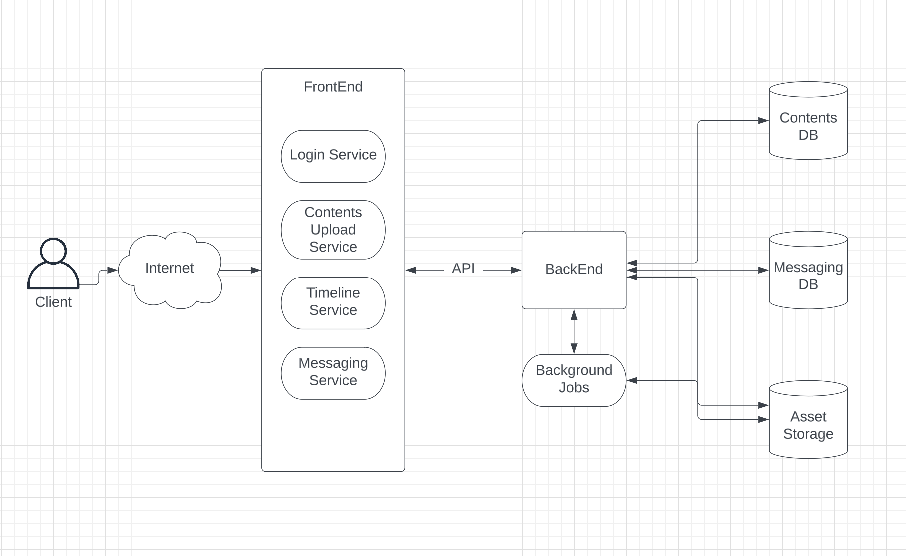
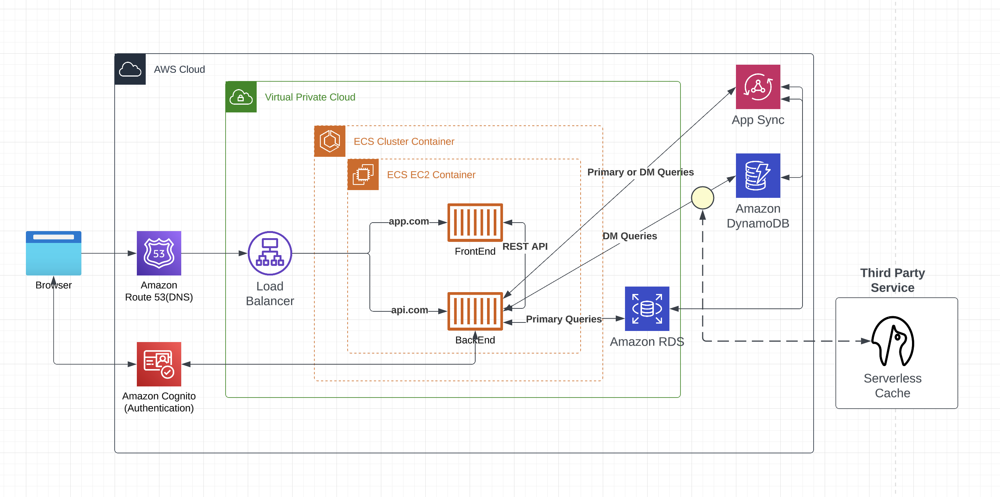
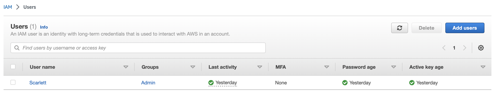
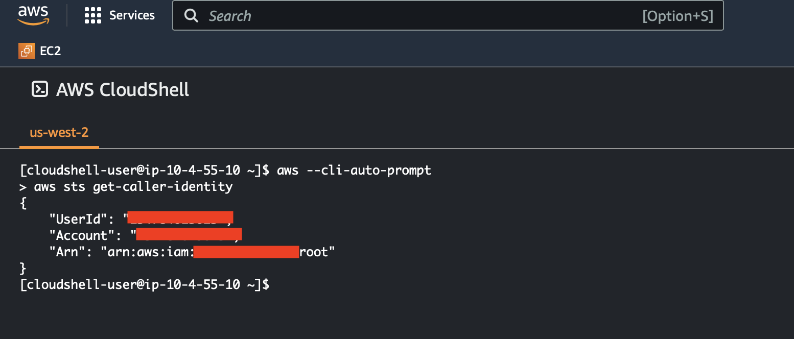
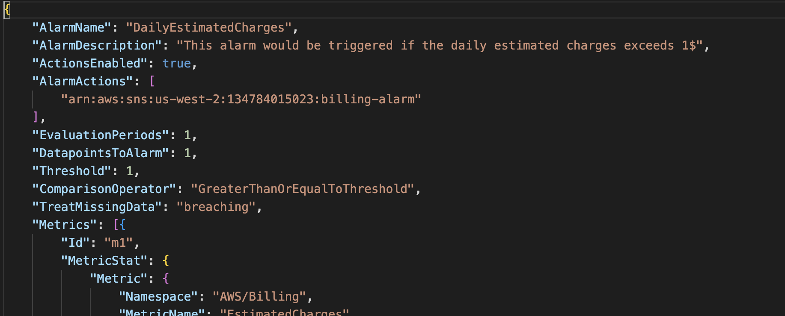
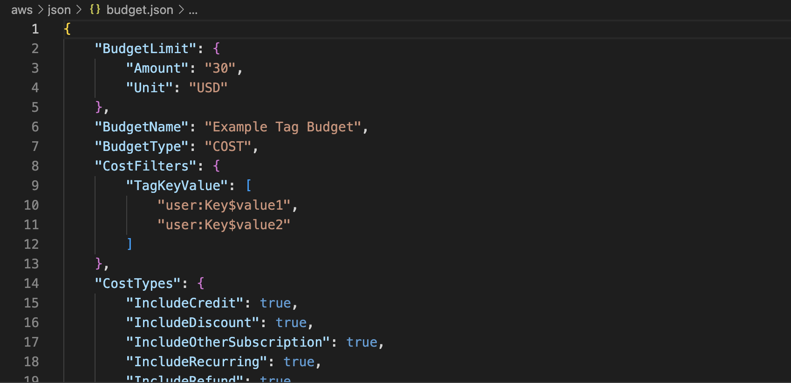
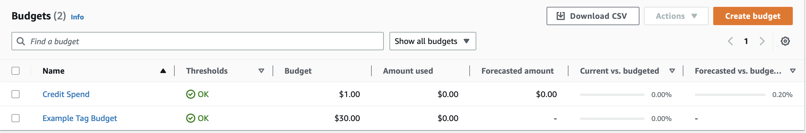

# Week 0 — Billing and Architecture

## Recreate Conceptual Diagram in Lucid Charts or on a Napkin
- A conceptual model is a representation of a system. It consists of concepts used to help people know, understand, or simulate a subject the model represents.




Link to Lucid Chart:
https://lucid.app/lucidchart/f1f972d7-5bd5-48fc-8875-28015f79d9ac/edit?viewport_loc=32%2C-23%2C2048%2C1032%2CxN_w2ZR99t24&invitationId=inv_567d65a3-2659-4dca-a608-a1965050eefd

## Recreate Logical Architectual Diagram in Lucid Charts
- Logical diagrams describe how a solution works in terms of function and logical information. It illustrates connectivity between applications and therefore the flow or sequence between components.


## Create an Admin User
- Go to IAM in AWS console
- Create a new user in Users tab with Adminaccess


## Use CloudShell
- CloudShell can be used using a terminal icon in AWS console
- syntax "--cli-auto-prompt" activates auto-complete function


## Generate AWS Credentials and Installed AWS CLI
- Using syntax below, you can make your environment to install CLI automatically whenever you start your Gitpod

Update our `.gitpod.yml` to include the following task.

```sh
tasks:
  - name: aws-cli
    env:
      AWS_CLI_AUTO_PROMPT: on-partial
    init: |
      cd /workspace
      curl "https://awscli.amazonaws.com/awscli-exe-linux-x86_64.zip" -o "awscliv2.zip"
      unzip awscliv2.zip
      sudo ./aws/install
      cd $THEIA_WORKSPACE_ROOT
```
- You can also set PATH so that your working environment can remember your AWS account 

Find these three info below and export them using the syntax below.
It will make Gitpod to remember these credentials if we relaunch our workspaces

```
gp env AWS_ACCESS_KEY_ID=""
gp env AWS_SECRET_ACCESS_KEY=""
gp env AWS_DEFAULT_REGION=us-east-1
```

Check if your environment with the credentials is set using the syntax below

```sh
aws sts get-caller-identity
```


## Create a AWS Billing Alarm
- You can set it using AWS console or your work environment(e.g. vscode)
- The detailed syntax and commends are in aws/json folder



## Create a AWS Budget

- Set two AWS bedgets, one for monthly spend and one for credit spend
- This can be set through AWS console or CLI commends that is is aws/json folder
- The syntax is also included in the folder






### References

https://github.com/omenking/aws-bootcamp-cruddur-2023/blob/week-0/journal/week0.md