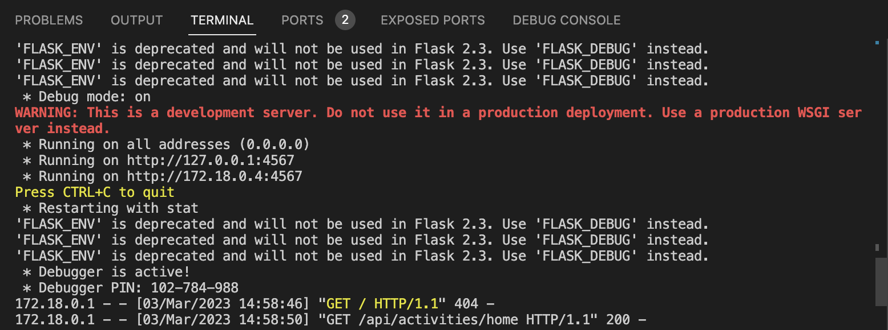
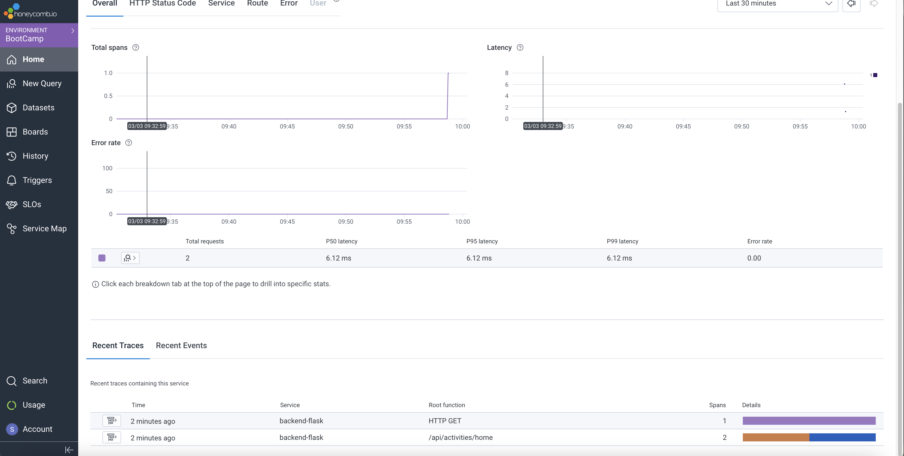
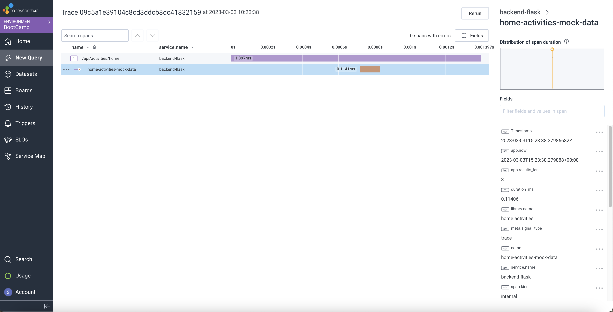
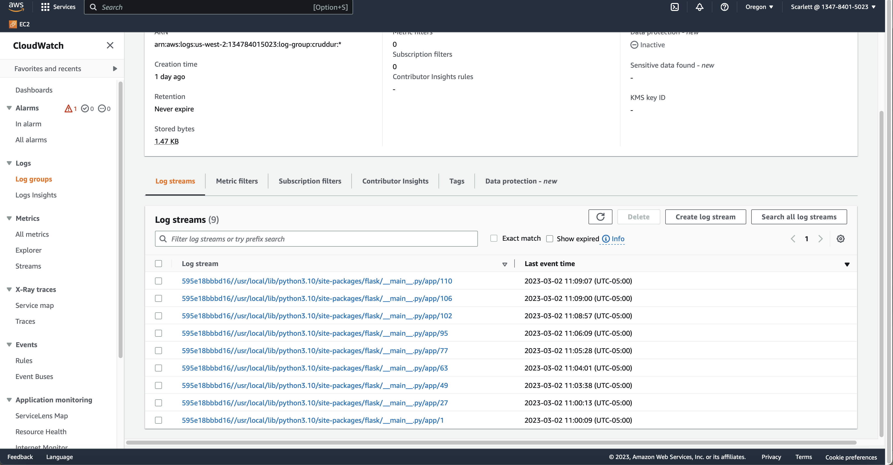
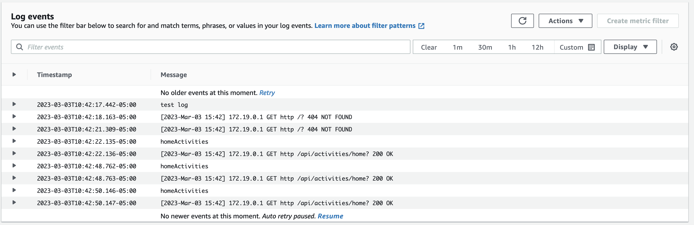
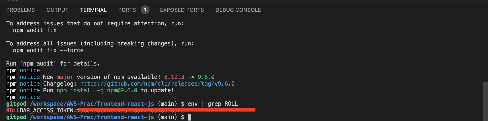
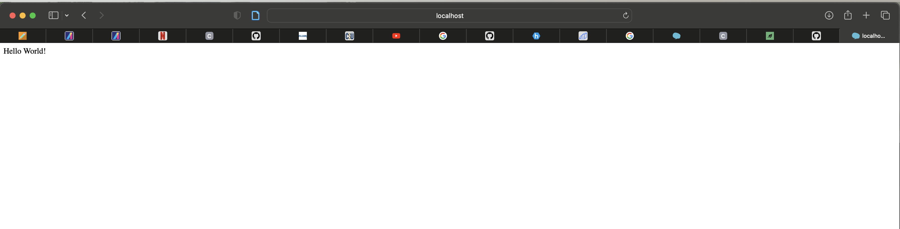
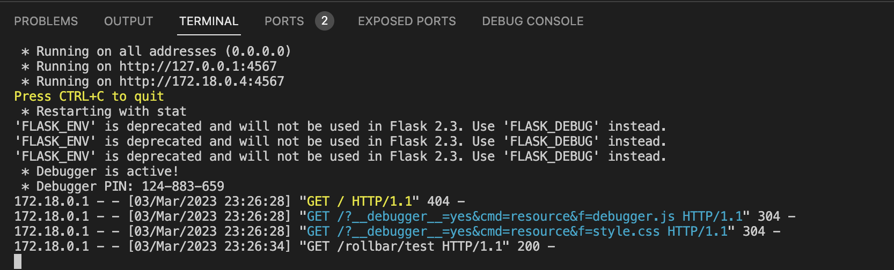
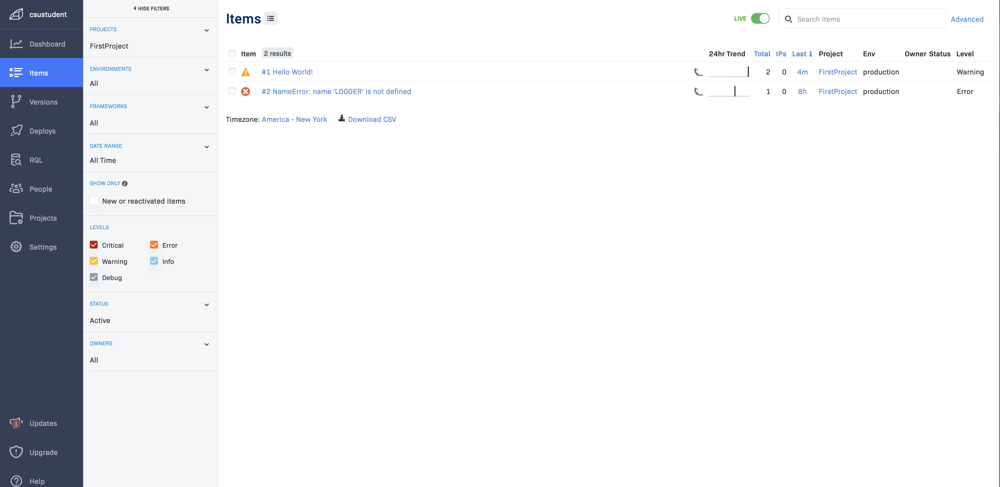

# Week 2 — Distributed Tracing

## Before starting
To open the necessary ports automatically, add the following in gitpod.yml file

```yml
ports:
  - name: frontend
    port: 3000
    onOpen: open-browser
    visibility: public
  - name: backend
    port: 4567
    visibility: public
  - name: xray-daemon
    port: 2000
    visibility: public
```
> This way, we do not need to unlock the ports every time we do docker compose-up

To install npm automatically when gitpod starts, add the following in gitpod.yml file

```yml
  - name: react-js
    command: |
      cd frontend-react-js
      npm i
``` 

## Instrument Honeycomb with OTEL

### Honeycomb
- Honeycomb is a software debugging tool that can help devlopeers solve problems faster within your distributed services. It enables fast fault localization, no matter how complex the application architecture. Honeycomb helps devlopers analyze data to discover issues buried deep within the stack.

### Honeycomb Setup
1. Create an account
2. Create an evironment and use the API key to connect with your application

In the terminal, export the API key and service name(set it for Gitpod as well)

```sh
export HONEYCOMB_API_KEY=""
gp env HONEYCOMB_API_KEY=""
export HONEYCOMB_SERVICE_NAME="Cruddur"
gp env HONEYCOMB_SERVICE_NAME="Cruddur"
```


Add the environment variables to backend-flask in docker compose file
The service name has to be identifiable since this is going to determine the service name in the spans. You do not want it to be consistent between different services.

```yml
OTEL_EXPORTER_OTLP_ENDPOINT: "https://api.honeycomb.io"
OTEL_EXPORTER_OTLP_HEADERS: "x-honeycomb-team=${HONEYCOMB_API_KEY}"
OTEL_SERVICE_NAME: 'backend-flask'
```

Add the following files to the requirements.txt so that the files can be automatically installed when do 'Docker Compose Up'

```
opentelemetry-api 
opentelemetry-sdk 
opentelemetry-exporter-otlp-proto-http 
opentelemetry-instrumentation-flask 
opentelemetry-instrumentation-requests
```

Import the necessary libraries for Honeycomb in backend-flask/app.py
```py
from opentelemetry import trace
from opentelemetry.instrumentation.flask import FlaskInstrumentor
from opentelemetry.instrumentation.requests import RequestsInstrumentor
from opentelemetry.exporter.otlp.proto.http.trace_exporter import OTLPSpanExporter
from opentelemetry.sdk.trace import TracerProvider
from opentelemetry.sdk.trace.export import BatchSpanProcessor
```

Initialize tracing and an exporter that can send data to Honeycomb(in backend-flask/app.py)
```py
provider = TracerProvider()
processor = BatchSpanProcessor(OTLPSpanExporter())
provider.add_span_processor(processor)
trace.set_tracer_provider(provider)
tracer = trace.get_tracer(__name__)
```

Initialize automatic instrumentation with Flask(in backend-flask/app.py)
```py
FlaskInstrumentor().instrument_app(app)
RequestsInstrumentor().instrument()
```
> Remember to put this under app = Flask(__name__)

## Result from instrumenting backend

After running 'Docker compose-up' and access 'http://localhost:4567/api/activities/home',



> When I checked the log of backend conatiner, I can see the access log




> My application sends the backend data successfully to Honeycomb

### Now, create a span!

Add the following in backend-flask/home_activities.py 
```py
from opentelemetry import trace
tracer = trace.get_tracer("home.activities")
```
> Remember to put this before the class definition

Put the following inside of def run():
```py
with tracer.start_as_current_span("home-activities-mock-data"):
```
> The first line indicates the span name
> Remember to indent the code that were there originally.

### Now, add attributes to the span!

The first attribute will return information about time using now() func
Add the following in the current span in backend-flask/home_activities.py 

```py
span = trace.get_current_span()
now = datetime.now(timezone.utc).astimezone()
span.set_attribute("app.now", now.isoformat())
```

Also, add the second attirbute at the end of the current function(right before return statement)
It will return the length of the returning list

```py
span.set_attribute("app.results_len", len(results))
```

## Result from creating a span ad attirbutes



> Now I can see two spans and attributes on the right side(app.now & app.results_len)


## Instrument AWS X-Ray

## Configure custom logger to send to CloudWatch Logs

Add to the requirements.txt

```
watchtower
```

Set the environment variables in Docker-compose.yml file

```yml
AWS_DEFAULT_REGION: "${AWS_DEFAULT_REGION}"
AWS_ACCESS_KEY_ID: "${AWS_ACCESS_KEY_ID}"
AWS_SECRET_ACCESS_KEY: "${AWS_SECRET_ACCESS_KEY}"
```

Import the necessary libraries in backend-flask/app.py

```py
import watchtower
import logging
from time import strftime
```

Configure Logger to Use CloudWatch by adding the following in app.py

```py
LOGGER = logging.getLogger(__name__)
LOGGER.setLevel(logging.DEBUG)
console_handler = logging.StreamHandler()
cw_handler = watchtower.CloudWatchLogHandler(log_group='cruddur')
LOGGER.addHandler(console_handler)
LOGGER.addHandler(cw_handler)
LOGGER.info("some message")
```

Create a function in app.py file.
This will collect an error to show info 
```py
@app.after_request
def after_request(response):
    timestamp = strftime('[%Y-%b-%d %H:%M]')
    LOGGER.error('%s %s %s %s %s %s', timestamp, request.remote_addr, request.method, request.scheme, request.full_path, response.status)
    return response
```

Edit the def data_home(): function in app.py
```py
@app.route("/api/activities/home", methods=['GET'])
@cross_origin()
def data_home():
  data = HomeActivities.run(Logger=LOGGER)
  return data, 200
```
> It will enables HomeActivies function to recieve Logger as a parameter and pass it to the func

Edit the HomeActivities function in home_activities.py
```py
def run(Logger):  
    Logger.info("homeActivities")
```
## Result from setting Cloudwatch Logs




> After setting it successfully, I disabled it for spend concerns.

## Integrate Rollbar and capture and error

First, create an account in Rollbar and create a project
I made a project only for backend(Flask)

Add the following in backend-flask/requirements.txt

```
blinker
rollbar
```

Run the following commends to install everything in requirements.txt

```sh
pip install -r requirements.txt
```

Export and set the env vars
```sh
export ROLLBAR_ACCESS_TOKEN=""
gp env ROLLBAR_ACCESS_TOKEN=""
```
> You can find it from Rollbar after creating a project

Check if the environment variable is set correctly



Add the following in Docker-compose file

```yml
ROLLBAR_ACCESS_TOKEN: "${ROLLBAR_ACCESS_TOKEN}"
```

Import the necessary libraries in backend-flask/app.py file

```py
import rollbar
import rollbar.contrib.flask
from flask import got_request_exception
```

Add the following code in app.py file

```py
rollbar_access_token = os.getenv('ROLLBAR_ACCESS_TOKEN')
@app.before_first_request
def init_rollbar():
    """init rollbar module"""
    rollbar.init(
        # access token
        rollbar_access_token,
        # environment name
        'production',
        # server root directory, makes tracebacks prettier
        root=os.path.dirname(os.path.realpath(__file__)),
        # flask already sets up logging
        allow_logging_basic_config=False)

    # send exceptions from `app` to rollbar, using flask's signal system.
    got_request_exception.connect(rollbar.contrib.flask.report_exception, app)
```
> Remember to put this under app = Flask(__name__)

To add an end point for testing, add the following function in app.py file

```py
@app.route('/rollbar/test')
def rollbar_test():
    rollbar.report_message('Hello World!', 'warning')
    return "Hello World!"
```

Run Docker Compose-up and go to http://localhost:4567/rollbar/test



> I can see "hello world" message comming from the function above.



> I can also see the request from backend container log



> I can also see the log in Rollbar dashboard. The hello world message is sent over and an error that I encountered while practicing is also shown there.