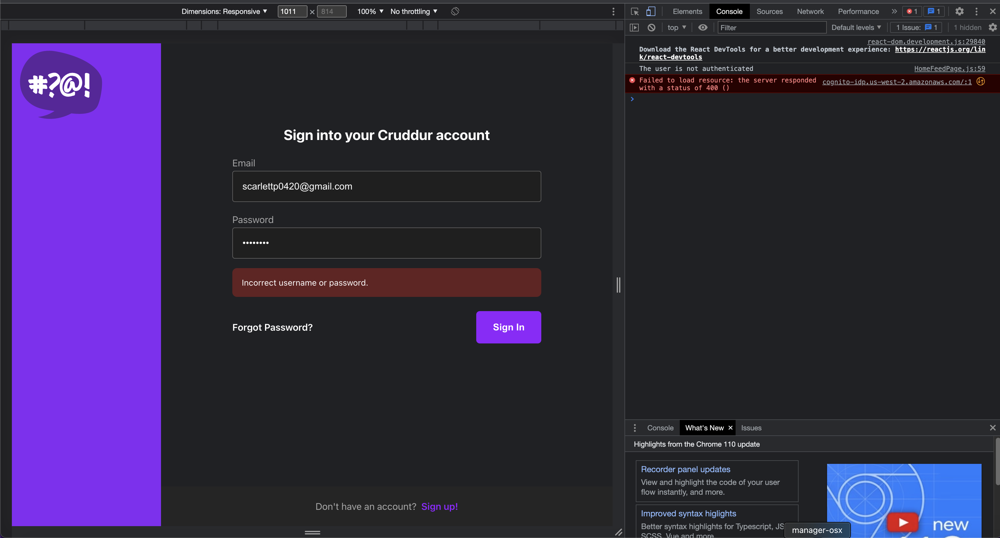
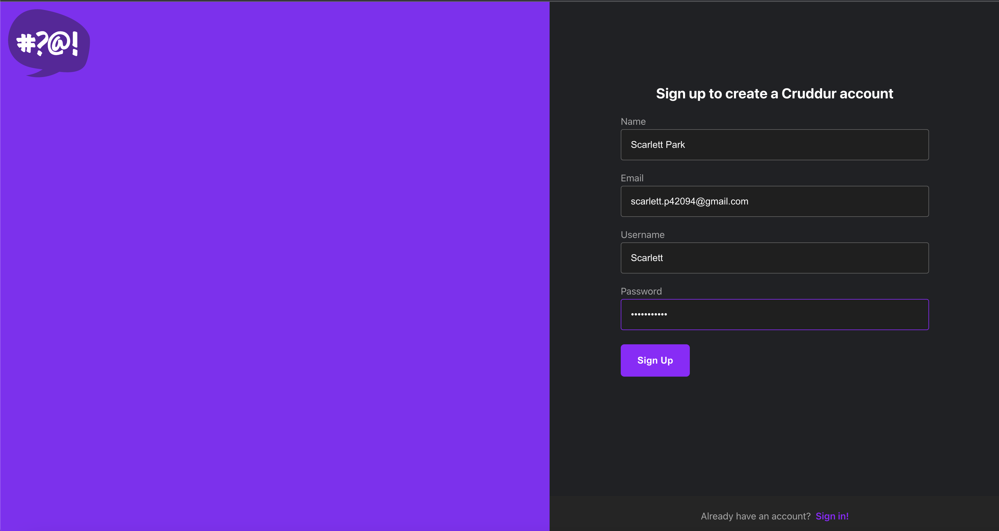
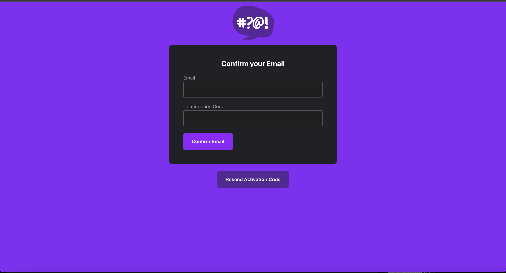
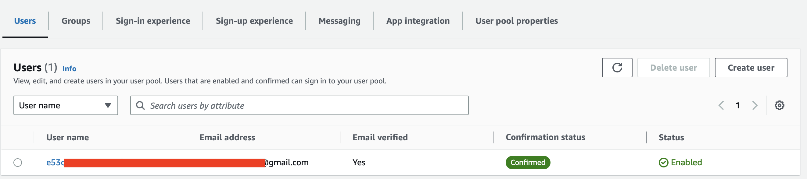
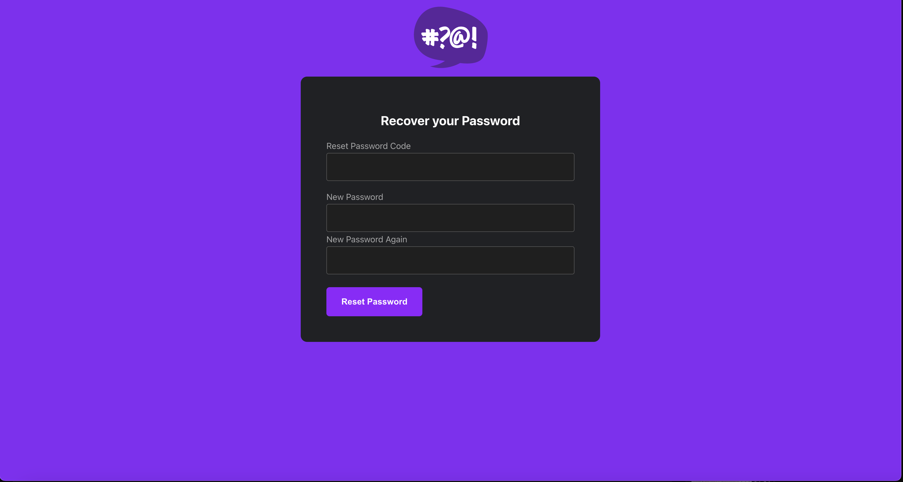
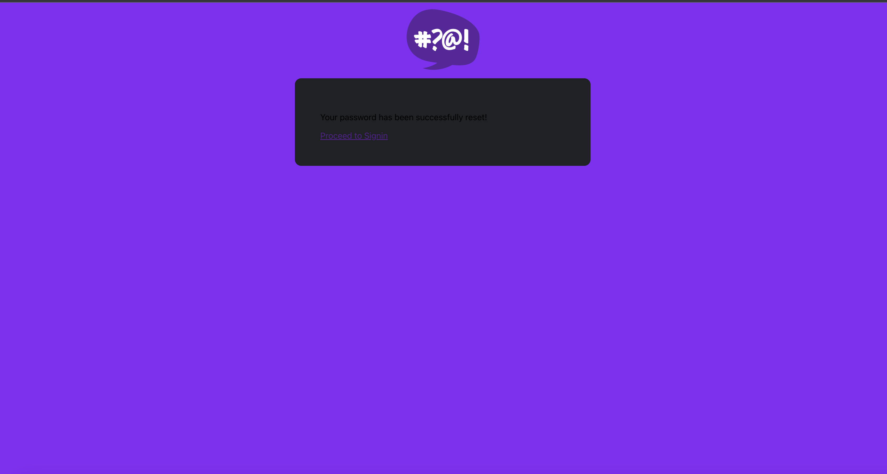
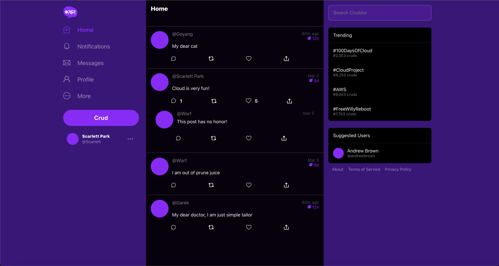
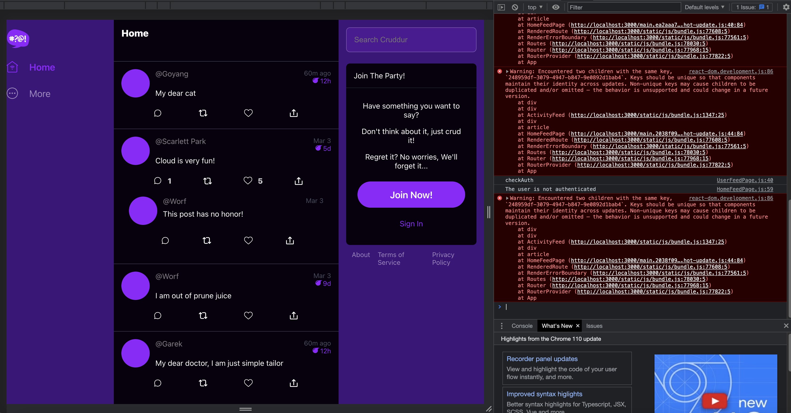
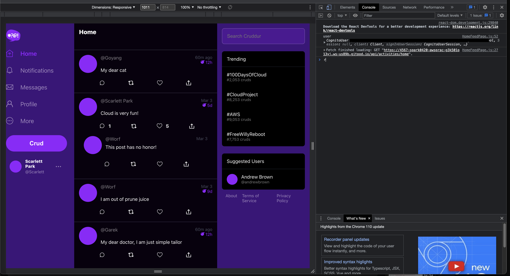

# Week 3 — Decentralized Authentication

## Setup Cognito User Pool
1. Go to Cognito in AWS console
2. Create a user pool
    - Provider type = Cognito user pool
    - Cognito user pool sign-in options = Email
    - Password policy mode = Cognito defauls
    - Multi-factor authentication = No MFA
    - User account recovery = Enable self-service account recovery, Email Only
    - Additional attribute = name, preferred_username
    - I am not using Amazon SES service
    - I am not using Cognito Hosted UI
    - App type = Public client
    - I am not using client secret 

We are using AWS amplify to implement authentication in the front-end which uses JavaScript
> References: https://docs.amplify.aws/lib/auth/emailpassword/q/platform/js/

### Install AWS amplify library by running the below in /frontend-react-js
```sh
npm i aws-amplify --save
```
> the --save flag would update the dependencies in the project's package. json file, but npm install now includes this functionality by default. At this point if you want to prevent npm install from saving dependencies, you have to use the --no-save flag.

### Import the Amplify library in App.js 
```js
import { Amplify } from 'aws-amplify';
```

### Configure Amplify in App.js
```js
Amplify.configure({
  "AWS_PROJECT_REGION": process.env.REACT_APP_AWS_PROJECT_REGION,
  "aws_cognito_region": process.env.REACT_APP_AWS_COGNITO_REGION,
  "aws_user_pools_id": process.env.REACT_APP_AWS_USER_POOLS_ID,
  "aws_user_pools_web_client_id": process.env.REACT_APP_CLIENT_ID,
  "oauth": {},
  Auth: {
    // We are not using an Identity Pool
    // identityPoolId: process.env.REACT_APP_IDENTITY_POOL_ID, // REQUIRED - Amazon Cognito Identity Pool ID
    region: process.env.REACT_APP_AWS_PROJECT_REGION,           // REQUIRED - Amazon Cognito Region
    userPoolId: process.env.REACT_APP_AWS_USER_POOLS_ID,         // OPTIONAL - Amazon Cognito User Pool ID
    userPoolWebClientId: process.env.REACT_APP_CLIENT_ID,   // OPTIONAL - Amazon Cognito Web Client ID (26-char alphanumeric string)
  }
});
```

### Now we need to set Environment variables for the variables above
### Set them under front-end in Docker-compose.yml file
```yml
REACT_APP_AWS_PROJECT_REGION: "${AWS_DEFAULT_REGION}"
REACT_APP_AWS_COGNITO_REGION: "${AWS_DEFAULT_REGION}"
REACT_APP_AWS_USER_POOLS_ID: "us-west-2_tFqwGCzXW"
REACT_APP_CLIENT_ID: "33tcb80psa28sn9qk9bufock1s"
```
> These information can be found in AWS console > Cognito > User pool

Based on the log-in status, we will show certain contents in the main page or not.
To do so, we need to check the authentication in HomeFeedPage.js.

### Import the Amplify library in frontend-react-js/src/pages/HomeFeedPage.js
```js
import { Auth } from 'aws-amplify';
```

### Add a function to check authentication
```js
// set a state
const [user, setUser] = React.useState(null);

// check if we are authenicated
const checkAuth = async () => {
  Auth.currentAuthenticatedUser({
    // Optional, By default is false. 
    // If set to true, this call will send a 
    // request to Cognito to get the latest user data
    bypassCache: false 
  })
  .then((user) => {
    console.log('user',user);
    return Auth.currentAuthenticatedUser()
  }).then((cognito_user) => {
      setUser({
        display_name: cognito_user.attributes.name,
        handle: cognito_user.attributes.preferred_username
      })
  })
  .catch((err) => console.log(err));
};
```
> Because some functions in DesktopNavigaion.js and DesktopSidebar uses the 'user' info that we are passing from the fuction 'checkAuth', they will show or not show some contents based on the authentication

### Update profileInfo.js to enable Cognito authenticatio there as well
### Import the Amplify library in profileInfo.js 
```js
import { Auth } from 'aws-amplify';
```

### Replace Sign-out fuction that were using cookies
```js
const signOut = async () => {
  try {
      await Auth.signOut({ global: true });
      window.location.href = "/"
  } catch (error) {
      console.log('error signing out: ', error);
  }
}
```

## Implement Custom Signin Page

Update SigninPage.js to enable Cognito authenticatio there as well
### Import the Amplify library in SigninPage.js 
```js
import { Auth } from 'aws-amplify';
```

### Replace onsubmit function that were using cookies
```js
const onsubmit = async (event) => {
    setErrors('')
    event.preventDefault();

    Auth.signIn(email, password)
      .then(user => {
        console.log('user', user)
        localStorage.setItem("access_token", user.signInUserSession.accessToken.jwtToken)
        window.location.href = "/"
      })
      .catch(error => {
        if (error.code == 'UserNotConfirmedException') {
          window.location.href = "/confirm"
        }
        setErrors(error.message)
      });
    return false
  }
```
> Here, we uare using 'setErrors' instead of 'setCognitoErrors'
> Upon sign-in, the fuction above returns an access_token and saves it in a localStorage

## Result from Implementing Custom Signin Page



> Because I used an incorrect username and password, it shows an error message. 
> Network console should show an error saying "Uncaught (in promise) NotAuthorizedException: Incorrect username or password" at this stage. Mine is not showing it since I already set authorization in the server-side and set a different error message.

### Create a user For testing

Create a user using AWS Cognito console
When you create a user, its status set to FORCE_CHANGE_PASSWORD at the beginning.
AWS console does not allow it to happen using AWS console.
Therefore, use CLI 

In terminal, run the following with correct values
```sh
aws cognito-idp admin-set-user-password \
  --user-pool-id <your-user-pool-id> \
  --username <username> \
  --password <password> \
  --permanent
```

## Implement Custom Signup Page

### Import the Amplify library in SignupPage.js 
```js
import { Auth } from 'aws-amplify';
```

### Replace onsubmit function that were using cookies
```js
const onsubmit = async (event) => {
    setErrors('')
    event.preventDefault();

    Auth.signIn(email, password)
      .then(user => {
        console.log('user', user)
        localStorage.setItem("access_token", user.signInUserSession.accessToken.jwtToken)
        window.location.href = "/"
      })
      .catch(error => {
        if (error.code == 'UserNotConfirmedException') {
          window.location.href = "/confirm"
        }
        setErrors(error.message)
      });
    return false
  }
```

## Implement Custom Confirmation Page

### Import the Amplify library in ConfirmationPage.js 
```js
import { Auth } from 'aws-amplify';
```

### Replace resend and onsubmit function that were using cookies
```js
const resend_code = async (event) => {
    setErrors('')
    try {
      await Auth.resendSignUp(email);
      console.log('code resent successfully');
      setCodeSent(true)
    } catch (err) {
      // does not return a code
      // does cognito always return english
      // for this to be an okay match?
      console.log(err)
      if (err.message == 'Username cannot be empty'){
        setErrors("You need to provide an email in order to send Resend Activiation Code")   
      } else if (err.message == "Username/client id combination not found."){
        setErrors("Email is invalid or cannot be found.")   
      }
    }
  }

  const onsubmit = async (event) => {
    event.preventDefault();
    setErrors('')
    try {
      await Auth.confirmSignUp(email, code);
      window.location.href = "/"
    } catch (error) {
      setErrors(error.message)
    }
    return false
  }
```
## Result from implementing Sign-up and Confirmation pages



> After inserting valid format of email address and password, it will lead to the confirmation page



> Cognito automatically send an email with confirmation code



> After inserting the confirmation code, I can also see that the user is created in the Cognito console


## Implement Custom Recovery Page

### Import the Amplify library in RecoverPage.js 
```js
import { Auth } from 'aws-amplify';
```

### Replace onsubmit_send_code and onsubmit_confirm_code functions 
```js
const onsubmit_send_code = async (event) => {
    event.preventDefault();
    setErrors('')
    Auth.forgotPassword(username)
    .then((data) => setFormState('confirm_code') )
    .catch((err) => setErrors(err.message) );
    return false
  }

  const onsubmit_confirm_code = async (event) => {
  event.preventDefault();
  setErrors('')
  if (password == passwordAgain){
    Auth.forgotPasswordSubmit(username, code, password)
    .then((data) => setFormState('success'))
    .catch((err) => setErrors(err.message) );
  } else {
    setErrors('Passwords do not match')
  }
  return false
  }
```

## Result from implementing Recovery pages



> Cognito automatically send an email with Reset Password code



> After typing the code and new password, I can successfully log-in with the new password

## Cognito JWT SErver side Verify

The purpose of this step is to pass the access_token to the back-end

Put the code below in HomeFeedPage.js
```js
  headers: {
    Authorization: `Bearer ${localStorage.getItem("access_token")}`
  }
```
> It will allow us to pass the access_token('Authorization') to the backend

### Put the header and authorization in CORS in backend-flaks/app.py

```py
cors = CORS(
  app, 
  resources={r"/api/*": {"origins": origins}},
  headers=['Content-Type', 'Authorization'], 
  expose_headers='Authorization',
  methods="OPTIONS,GET,HEAD,POST"
)
```
> It is to read the access_token in the backend

### To test if the Homepage recieves the header
```py
app.logger.debug(request.headers.get('Authorization'))
```
> It enables to see the token value in the Docker backend log
> Remove it after checking it works

### put Cognito library in requirements.txt file
```
Flask-AWSCognito
```
> It will automatically install the library when the app starts
> To run it again, do 'pip install -r requirements.txt' in /backend-flask

### Update Env var in Docker-compose.yml file
```yml
AWS_COGNITO_USER_POOL_ID: "us-west-2_tFqwGCzXW"
AWS_COGNITO_USER_POOL_CLIENT_ID: "33tcb80psa28sn9qk9bufock1s"
```

### Create a folder and file for Cognito under backend-flask
```
backend-flask/lib/cognito_token.py
```

### Put the code below in cognito_token.py 
```py
import time
import requests
from jose import jwk, jwt
from jose.exceptions import JOSEError
from jose.utils import base64url_decode

class FlaskAWSCognitoError(Exception):
    pass

class TokenVerifyError(Exception):
    pass


def extract_access_token(request_headers):
    access_token = None
    auth_header = request_headers.get("Authorization")
    if auth_header and " " in auth_header:
        _, access_token = auth_header.split()
    return access_token


class CognitoToken:
    def __init__(self, user_pool_id, user_pool_client_id, region, request_client=None):
        self.region = region
        if not self.region:
            raise FlaskAWSCognitoError("No AWS region provided")
        self.user_pool_id = user_pool_id
        self.user_pool_client_id = user_pool_client_id
        self.claims = None
        if not request_client:
            self.request_client = requests.get
        else:
            self.request_client = request_client
        self._load_jwk_keys()


    def _load_jwk_keys(self):
        keys_url = f"https://cognito-idp.{self.region}.amazonaws.com/{self.user_pool_id}/.well-known/jwks.json"
        try:
            response = self.request_client(keys_url)
            self.jwk_keys = response.json()["keys"]
        except requests.exceptions.RequestException as e:
            raise FlaskAWSCognitoError(str(e)) from e

    @staticmethod
    def _extract_headers(token):
        try:
            headers = jwt.get_unverified_headers(token)
            return headers
        except JOSEError as e:
            raise TokenVerifyError(str(e)) from e

    def _find_pkey(self, headers):
        kid = headers["kid"]
        # search for the kid in the downloaded public keys
        key_index = -1
        for i in range(len(self.jwk_keys)):
            if kid == self.jwk_keys[i]["kid"]:
                key_index = i
                break
        if key_index == -1:
            raise TokenVerifyError("Public key not found in jwks.json")
        return self.jwk_keys[key_index]

    @staticmethod
    def _verify_signature(token, pkey_data):
        try:
            # construct the public key
            public_key = jwk.construct(pkey_data)
        except JOSEError as e:
            raise TokenVerifyError(str(e)) from e
        # get the last two sections of the token,
        # message and signature (encoded in base64)
        message, encoded_signature = str(token).rsplit(".", 1)
        # decode the signature
        decoded_signature = base64url_decode(encoded_signature.encode("utf-8"))
        # verify the signature
        if not public_key.verify(message.encode("utf8"), decoded_signature):
            raise TokenVerifyError("Signature verification failed")

    @staticmethod
    def _extract_claims(token):
        try:
            claims = jwt.get_unverified_claims(token)
            return claims
        except JOSEError as e:
            raise TokenVerifyError(str(e)) from e

    @staticmethod
    def _check_expiration(claims, current_time):
        if not current_time:
            current_time = time.time()
        if current_time > claims["exp"]:
            raise TokenVerifyError("Token is expired")  # probably another exception

    def _check_audience(self, claims):
        # and the Audience  (use claims['client_id'] if verifying an access token)
        audience = claims["aud"] if "aud" in claims else claims["client_id"]
        if audience != self.user_pool_client_id:
            raise TokenVerifyError("Token was not issued for this audience")

    def verify(self, token, current_time=None):
        """ https://github.com/awslabs/aws-support-tools/blob/master/Cognito/decode-verify-jwt/decode-verify-jwt.py """
        if not token:
            raise TokenVerifyError("No token provided")

        headers = self._extract_headers(token)
        pkey_data = self._find_pkey(headers)
        self._verify_signature(token, pkey_data)

        claims = self._extract_claims(token)
        self._check_expiration(claims, current_time)
        self._check_audience(claims)

        self.claims = claims
        return claims
```

### Import the file in app.py
```py
from lib.cognito_token import CognitoToken, extract_access_token, TokenVerifyError
```

### Initialize the CognitoToken class
```py
cognito_token = CognitoToken(
  user_pool_id = os.getenv("AWS_COGNITO_USER_POOL_ID"),
  user_pool_client_id = os.getenv("AWS_COGNITO_USER_POOL_CLIENT_ID"),
  region = os.getenv("AWS_DEFAULT_REGION")
)
```

### Update data_home() function in app.py
```py
@app.route("/api/activities/home", methods=['GET'])
@xray_recorder.capture('activities_home')
@cross_origin()
def data_home():
  access_token = extract_access_token(request.headers)
  try:
    claims = cognito_token.verify(access_token)
    app.logger.debug('authenticated!')
    app.logger.debug(claims)
    app.logger.debug(claims['username'])
    data = HomeActivities.run(cognito_user_id=claims['username'])
  except TokenVerifyError as e:
    app.logger.debug(e)
    app.logger.debug('unauthenticated')
    data = HomeActivities.run()
``` 
> Retreive the access_token using extract_access_token() function
> verify() function will verify access_token and return claims
> 'data' will show different contents depends on the user' authentication

### Update ProfileInfo.js
```js
const signOut = async () => {
    try {
        await Auth.signOut({ global: true });
        window.location.href = "/"
        localStorage.removeItem("access_token");
    } catch (error) {
        console.log('error signing out: ', error);
    }
  }
```
> localStorage.removeItem("access_token") is added to remove the token after logout


## Result from implementing JWT authentication in backend


> After logging in with the correct username and password, 'app.logger.debug' syntax will return the authentication status in docker log(backend)

### Update home_activities.py
```py
def run(cognito_user_id=None):
```
> This is because when the function is called, we are passing the unique username from app.py

```py
if cognito_user_id != None:
        extra_crud = {
        'uuid': '248959df-3079-4947-b847-9e0892d1bab1',
        'handle':  'Goyang',
        'message': 'My dear cat',
        'created_at': (now - timedelta(hours=1)).isoformat(),
        'expires_at': (now + timedelta(hours=12)).isoformat(),
        'likes': 1994,
        'replies': []
        }
        results.insert(0, extra_crud)
```
> By appending this at the end of the function, the homepage will show an additioanl content depends on the authentication status


## Result from updating home_activities.py



> After logging in with the correct username and password, I can check one more content at the top

## Error I encountered



> After appending one more content, I could check there is an error in the screenshot

> After some research, I found out it is because the key(uuid) for the appended content is not unique. It was because I just copied and pasted the hard-coded uuid that is above in the function. After changing one number at the end, I could solve the problem



> I don't see the error anymore

> Reference: https://github.com/cgauge/Flask-AWSCognito

## UI Update

To make the UI a little brighter and increase the contrast,
I edited some colors in the front-end

```css
:root {
  --bg: rgb(62,13,123);
  --fg: rgb(8,1,14);

  --field-border: rgba(255,255,255,0.29);
  --field-border-focus: rgba(149,0,255,1);
  --field-bg: rgba(149,0,255,0.2);
}
```
> This is for unification and conveniency purpose


> It is now a little brighter
> However, I am planning to adjust the font-colors because it is a little hard to read in Mac


