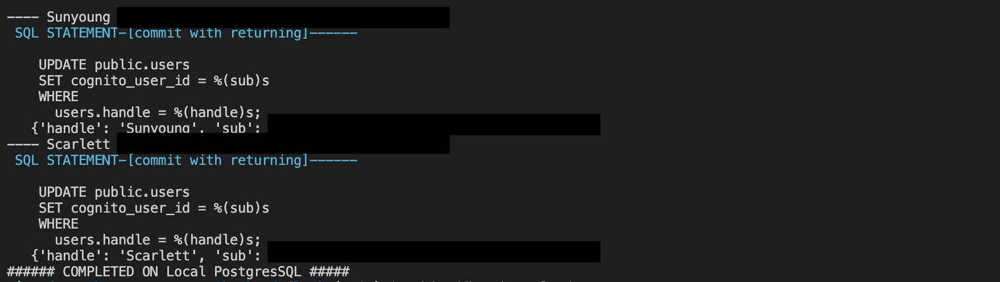

# Week 5 — DynamoDB and Serverless Caching

## Implement DynamoDB Scripts

First, add boto3 to the backend-flask/requirements.txt file
```sh
boto3
```
> boto3 is AWS SDK for python
> Run pip install -r requirements.txt to install the library

Now, we are going to cread a DynamoDB local before creating one in AWS

Make sure to have the following in Docker-compose.yml
```yml
dynamodb-local:
    # https://stackoverflow.com/questions/67533058/persist-local-dynamodb-data-in-volumes-lack-permission-unable-to-open-databa
    # We needed to add user:root to get this working.
    user: root
    command: "-jar DynamoDBLocal.jar -sharedDb -dbPath ./data"
    image: "amazon/dynamodb-local:latest"
    container_name: dynamodb-local
    ports:
      - "8000:8000"
    volumes:
      - "./docker/dynamodb:/home/dynamodblocal/data"
    working_dir: /home/dynamodblocal
```

Create a new folder called 'ddb' under /backend-flask/bin
Create 'schema-load' file under /backend-flask/bin/ddb
```sh
#! /usr/bin/env python3

import boto3
import sys

attrs = {
    'endpoint_url': 'http://localhost:8000'
}
if len(sys.argv) == 2:
    if "prod" in sys.argv[1]:
        attrs = {}

ddb = boto3.client('dynamodb', **attrs)
table_name = 'cruddur-messages'

response = ddb.create_table(
    TableName = table_name,
    AttributeDefinitions=[
        {
            'AttributeName': 'message_group_uuid',
            'AttributeType': 'S'
        },
        {
            'AttributeName': 'pk',
            'AttributeType': 'S'
        },
        {
            'AttributeName': 'sk',
            'AttributeType': 'S'
        },
    ],
    KeySchema=[
        {
            'AttributeName': 'pk',
            'KeyType': 'HASH'
        },
        {
            'AttributeName': 'sk',
            'KeyType': 'RANGE'
        },
    ],
    GlobalSecondaryIndexes=[{
        'IndexName':'message-group-sk-index',
        'KeySchema':[{
        'AttributeName': 'message_group_uuid',
        'KeyType': 'HASH'
        },{
        'AttributeName': 'sk',
        'KeyType': 'RANGE'
        }],
        'Projection': {
        'ProjectionType': 'ALL'
        },
        'ProvisionedThroughput': {
        'ReadCapacityUnits': 5,
        'WriteCapacityUnits': 5
        },
    }],
    BillingMode='PROVISIONED',
    ProvisionedThroughput={
        'ReadCapacityUnits': 5,
        'WriteCapacityUnits': 5
    }
)

print(response)
```

Create 'list-tables' file under /backend-flask/bin/ddb
```sh
#! /usr/bin/bash
set -e # stop if it fails at any point

if [ "$1" = "prod" ]; then
    ENDPOINT_URL=""
else
    ENDPOINT_URL="--endpoint-url=http://localhost:8000"
fi

aws dynamodb list-tables $ENDPOINT_URL \
--query TableNames \
--output table
```

Create 'drop' file under /backend-flask/bin/ddb
```sh
#! /usr/bin/bash
set -e # stop if it fails at any point

#./bin/ddb/drop cruddur-messages prod

if [ -z "$1" ]; then
    echo "No TABLE_NAME argument supplied eg) ./bin/ddb/drop cruddur-messages prod"
    exit 1
fi
TABLE_NAME=$1

if [ "$2" = "prod" ]; then
    ENDPOINT_URL=""
else
    ENDPOINT_URL="--endpoint-url=http://localhost:8000"
fi

echo "$TABLE_NAME"

aws dynamodb delete-table $ENDPOINT_URL \
--table-name $TABLE_NAME
```

Create 'seed' file under /backend-flask/bin/ddb
```sh
#! /usr/bin/env python3

import boto3
import sys
from datetime import datetime, timedelta, timezone
import uuid
import os

current_path = os.path.dirname(os.path.abspath(__file__))
parent_path = os.path.abspath(os.path.join(current_path, '..', '..'))
sys.path.append(parent_path)
from lib.db import db

attrs = {
  'endpoint_url': 'http://localhost:8000'
}
# unset endpoint url for use with production database
if len(sys.argv) == 2:
  if "prod" in sys.argv[1]:
    attrs = {}
ddb = boto3.client('dynamodb',**attrs)

def get_user_uuids():
  sql = """
    SELECT 
      users.uuid,
      users.display_name,
      users.handle
    FROM users
    WHERE
      users.handle IN(
        %(my_handle)s,
        %(other_handle)s
        )
  """
  users = db.query_array_json(sql,{
    'my_handle':  'Sunyoung',
    'other_handle': 'Scarlett'
  })
  my_user    = next((item for item in users if item["handle"] == 'Sunyoung'), None)
  other_user = next((item for item in users if item["handle"] == 'Scarlett'), None)
  results = {
    'my_user': my_user,
    'other_user': other_user
  }
  print('get_user_uuids')
  print(results)
  return results


def create_message(client,message_group_uuid, created_at, message, my_user_uuid, my_user_display_name, my_user_handle):
    print("")

message_group_uuid = "5ae290ed-55d1-47a0-bc6d-fe2bc2700399" #str(uuid.uuid4())
users = get_user_uuids()
now = datetime.now(timezone.utc).astimezone()

def create_message_group(client,message_group_uuid, my_user_uuid, last_message_at=None, message=None, other_user_uuid=None, other_user_display_name=None, other_user_handle=None):
  table_name = 'cruddur-messages'
  record = {
    'pk':   {'S': f"GRP#{my_user_uuid}"},
    'sk':   {'S': last_message_at},
    'message_group_uuid': {'S': message_group_uuid},
    'message':  {'S': message},
    'user_uuid': {'S': other_user_uuid},
    'user_display_name': {'S': other_user_display_name},
    'user_handle': {'S': other_user_handle}
  }

  response = client.put_item(
    TableName=table_name,
    Item=record
  )
  print(response)

def create_message(client,message_group_uuid, created_at, message, my_user_uuid, my_user_display_name, my_user_handle):
  table_name = 'cruddur-messages'
  record = {
    'pk':   {'S': f"MSG#{message_group_uuid}"},
    'sk':   {'S': created_at },
    'message_uuid': { 'S': str(uuid.uuid4()) },
    'message': {'S': message},
    'user_uuid': {'S': my_user_uuid},
    'user_display_name': {'S': my_user_display_name},
    'user_handle': {'S': my_user_handle}
  }
  # insert the record into the table
  response = client.put_item(
    TableName=table_name,
    Item=record
  )
  # print the response
  print(response)


create_message_group(
  client=ddb,
  message_group_uuid=message_group_uuid,
  my_user_uuid=users['my_user']['uuid'],
  other_user_uuid=users['other_user']['uuid'],
  other_user_handle=users['other_user']['handle'],
  other_user_display_name=users['other_user']['display_name'],
  last_message_at=now.isoformat(),
  message="this is a filler message"
)

create_message_group(
  client=ddb,
  message_group_uuid=message_group_uuid,
  my_user_uuid=users['other_user']['uuid'],
  other_user_uuid=users['my_user']['uuid'],
  other_user_handle=users['my_user']['handle'],
  other_user_display_name=users['my_user']['display_name'],
  last_message_at=now.isoformat(),
  message="this is a filler message"
)

conversation = """
Person 1: Hello!
Person 2: Hi!
Person 1: Hello?
Person 2: Hi?
"""

lines = conversation.lstrip('\n').rstrip('\n').split('\n')
print("=============================")
print(lines)

for i in range(len(lines)):
  if lines[i].startswith('Person 1: '):
    key = 'my_user'
    message = lines[i].replace('Person 1: ', '')
  elif lines[i].startswith('Person 2: '):
    key = 'other_user'
    message = lines[i].replace('Person 2: ', '')
  else:
    print(lines[i])
    raise 'invalid line'

  created_at = (now + timedelta(minutes=i)).isoformat()
  create_message(
    client=ddb,
    message_group_uuid= message_group_uuid,
    created_at=created_at,
    message=message,
    my_user_uuid=users[key]['uuid'],
    my_user_display_name=users[key]['display_name'],
    my_user_handle=users[key]['handle']
  )
```

Create 'scan' file under /backend-flask/bin/ddb
```sh
#!/usr/bin/env python3

import boto3

attrs = {
  'endpoint_url': 'http://localhost:8000'
}
ddb = boto3.resource('dynamodb',**attrs)
table_name = 'cruddur-messages'

table = ddb.Table(table_name)
response = table.scan()
items = response['Items']
for item in items:
    print(item)
```

Create a new folder called 'patterns' under /backend-flask/bin/ddb
Create 'get-conversation' file under /backend-flask/bin/ddb/patterns
```sh
#!/usr/bin/env python3

import boto3
import sys
import json
import datetime

attrs = {
  'endpoint_url': 'http://localhost:8000'
}

if len(sys.argv) == 2:
  if "prod" in sys.argv[1]:
    attrs = {}

dynamodb = boto3.client('dynamodb',**attrs)
table_name = 'cruddur-messages'

message_group_uuid = "5ae290ed-55d1-47a0-bc6d-fe2bc2700399"
current_year = str(datetime.datetime.now().year)
# define the query parameters
query_params = {
  'TableName': table_name,
  'ReturnConsumedCapacity': 'TOTAL',
  'KeyConditionExpression': 'pk = :pk AND begins_with(sk,:year)',
#   'KeyConditionExpression': 'pk = :pk AND sk BETWEEN :start_date AND :end_date',
  'ScanIndexForward': False,
  'Limit': 20,
  'ExpressionAttributeValues': {
     ':year': {'S': current_year },
    # ":start_date": { "S": "2023-03-01T00:00:00.000000+00:00" },
    # ":end_date": { "S": "2023-03-19T23:59:59.999999+00:00" },
    ':pk': {'S': f"MSG#{message_group_uuid}"}
  }
}

# query the table
response = dynamodb.query(**query_params)

# print the items returned by the query
print(json.dumps(response, sort_keys=True, indent=2))

# print the consumed capacity
print(json.dumps(response['ConsumedCapacity'], sort_keys=True, indent=2))

items = response['Items']
items.reverse()


for item in items:
  sender_handle = item['user_handle']['S']
  message       = item['message']['S']
  timestamp     = item['sk']['S']
  dt_object = datetime.datetime.strptime(timestamp, '%Y-%m-%dT%H:%M:%S.%f%z')
  formatted_datetime = dt_object.strftime('%Y-%m-%d %I:%M %p')
  print(f'{sender_handle: <16}{formatted_datetime: <22}{message[:40]}...')
```

Create 'list-conversations' file under /backend-flask/bin/ddb/patterns
```sh
#!/usr/bin/env python3

import boto3
import sys
import json
import os
import datetime

current_path = os.path.dirname(os.path.abspath(__file__))
parent_path = os.path.abspath(os.path.join(current_path, '..', '..', '..'))
sys.path.append(parent_path)
from lib.db import db

attrs = {
  'endpoint_url': 'http://localhost:8000'
}

if len(sys.argv) == 2:
  if "prod" in sys.argv[1]:
    attrs = {}

dynamodb = boto3.client('dynamodb',**attrs)
table_name = 'cruddur-messages'

def get_my_user_uuid():
  sql = """
    SELECT 
      users.uuid
    FROM users
    WHERE
      users.handle =%(handle)s
  """
  uuid = db.query_value(sql,{
    'handle':  'Scarlett'
  })
  return uuid

my_user_uuid = get_my_user_uuid()
print(f"my-uuid: {my_user_uuid}")

current_year = str(datetime.datetime.now().year)
# define the query parameters
query_params = {
  'TableName': table_name,
      'KeyConditionExpression': 'pk = :pk AND begins_with(sk,:year)',
  'ScanIndexForward': False,
  'ExpressionAttributeValues': {
    ':year': {'S': current_year },
    ':pk': {'S': f"GRP#{my_user_uuid}"}
  },
  'ReturnConsumedCapacity': 'TOTAL'
}

# query the table
response = dynamodb.query(**query_params)

# print the items returned by the query
print(json.dumps(response, sort_keys=True, indent=2))
```

We added one more paramater in print_sql function in db.py file
```py
def print_sql(self,title,sql,params={}):
```
> Make sure to match the parameters where this function is called

Also edit the following part in backend-flask/bin/db/setup file
```sh
set -e # stop if it fails at any point
```


## Result from implementing DynamoDB Scripts
Make sure to do 'chmod u+x ./bin/ddb/filename' before running the scripts


> Make sure to run ./bin/db/setup before inserting seed data so that we can have the table 'users'
> Also, make sure to match the names in the table 'users' and 


> Reference: https://boto3.amazonaws.com/v1/documentation/api/latest/guide/dynamodb.html


## Implement Update Cognito ID Script for Postgres Database

Update gitpod.yml file so that the work environment can install requirements automatically
```yaml
  - name: flask
    command: |
      cd backend-flask
      pip install -r requirements.txt
```

Update backend-flask/bin/db/drop
```sh
psql $NO_DB_CONNECTION_URL -c "DROP DATABASE IF EXISTS cruddur;"
```

Update Docker-compose.yml file 
```yaml
AWS_ENDPOINT_URL: "http://dynamodb-local:8000"
```

Create ddb.py file for DynamoDB under backend-flask/lib
```py
import boto3
import sys
from datetime import datetime, timedelta, timezone
import uuid
import os
import botocore.exceptions

class Ddb:
    def client():
        endpoint_url = os.getenv("AWS_ENDPOINT_URL")
        if endpoint_url:
            attrs = { 'endpoint_url': endpoint_url }
        else:
            attrs = {}
        dynamodb = boto3.client('dynamodb',**attrs)
        return dynamodb


    def list_message_groups(client,my_user_uuid):
        table_name = 'cruddur-messages'
        current_year = str(datetime.now().year)
        query_params = {
            'TableName': table_name,
            'KeyConditionExpression': 'pk = :pk AND begins_with(sk,:year)',
            'ScanIndexForward': False,
            'Limit': 20,
            'ExpressionAttributeValues': {
                ':pk': {'S': f"GRP#{my_user_uuid}"},
                 ':year': {'S': current_year},
            }
        }
        print('query-params: ', query_params)
        print('client: ', client)

        # query the table
        response = client.query(**query_params)
        items = response['Items']

        print("items:: ", items)
        results = []
        for item in items:
            last_sent_at = item['sk']['S']
            results.append({
                'uuid': item['message_group_uuid']['S'],
                'display_name': item['user_display_name']['S'],
                'handle': item['user_handle']['S'],
                'message': item['message']['S'],
                'created_at': last_sent_at
            })
        return results
```
Create a file 'list-users' under backend-flask/bin/cognito
```sh
#!/usr/bin/env python3

import boto3
import os
import json

userpool_id = os.getenv("AWS_COGNITO_USER_POOL_ID")
client = boto3.client('cognito-idp')
params = {
    'UserPoolId': userpool_id,
    'AttributesToGet': [
        'preferred_username',
        'sub'
    ]
}
response = client.list_users(**params)
users = response['Users']

print(json.dumps(users, sort_keys=True, indent=2, default=str))

dict_users = {}
for user in users:
    attrs = user['Attributes']
    sub    = next((a for a in attrs if a["Name"] == 'sub'), None)
    handle = next((a for a in attrs if a["Name"] == 'preferred_username'), None)
    dict_users[handle['Value']] = sub['Value']
    
print(json.dumps(dict_users, sort_keys=True, indent=2, default=str))

```
> This function will retrieve cognito_user_id using AWS CLI to print
> Make sure to have the env var 'AWS_COGNITO_USER_POOL_ID'


Create a file 'update_cognito_user_ids' under backend-flask/bin/db
```sh
#!/usr/bin/env python3

import boto3
import os
import sys

print("== db-update-cognito-user-ids")

current_path = os.path.dirname(os.path.abspath(__file__))
parent_path = os.path.abspath(os.path.join(current_path, '..', '..'))
sys.path.append(parent_path)
from lib.db import db

def update_users_with_cognito_user_id(handle,sub):
  sql = """
    UPDATE public.users
    SET cognito_user_id = %(sub)s
    WHERE
      users.handle = %(handle)s;
  """
  db.query_commit(sql,{
    'handle' : handle,
    'sub' : sub
  })

def get_cognito_user_ids():
  userpool_id = os.getenv("AWS_COGNITO_USER_POOL_ID")
  client = boto3.client('cognito-idp')
  params = {
    'UserPoolId': userpool_id,
    'AttributesToGet': [
        'preferred_username',
        'sub'
    ]
  }
  response = client.list_users(**params)
  users = response['Users']
  dict_users = {}
  for user in users:
    attrs = user['Attributes']
    sub    = next((a for a in attrs if a["Name"] == 'sub'), None)
    handle = next((a for a in attrs if a["Name"] == 'preferred_username'), None)
    dict_users[handle['Value']] = sub['Value']
  return dict_users


users = get_cognito_user_ids()

for handle, sub in users.items():
  print('----',handle,sub)
  update_users_with_cognito_user_id(
    handle=handle,
    sub=sub
  )
```
> This function will retreive cognito_user_id using AWS CLI and insert the cognito_user_id into the db

Update 'setup' file under backend-flask/bin/db to call the function above
```sh
python "$bin_path/db/update_cognito_user_ids"
```

## Result from inserting Cognito user ids to the database



> Make sure to run 'chmod u+x /bin/db/update_cognito_user_ids' first before testing


## Implement Message Groups into Application

Update app.py file to call the function 'list_message_groups'
```py
@app.route("/api/message_groups", methods=['GET'])
@cross_origin()
def data_message_groups():
  access_token = extract_access_token(request.headers)
  try:
    claims = cognito_token.verify(access_token)
    app.logger.debug('authenticated!')
    app.logger.debug(claims)
    cognito_user_id = claims['sub']
    model = MessageGroups.run(cognito_user_id=cognito_user_id)
    if model['errors'] is not None:
      return model['errors'], 422
    else:
      return model['data'], 200
  except TokenVerifyError as e:
    app.logger.debug(e)
    return {}, 401
```

Update message_groups.py 
```py
from datetime import datetime, timedelta, timezone

from lib.ddb import Ddb
from lib.db import db

class MessageGroups:
  def run(cognito_user_id):
    model = {
      'errors': None,
      'data': None
    }

    sql = db.template('users','uuid_from_cognito_user_id')
    my_user_uuid = db.query_value(sql,{'cognito_user_id': cognito_user_id})

    print("UUID:", my_user_uuid)

    ddb = Ddb.client()
    data = Ddb.list_message_groups(ddb, my_user_uuid)
    print("list_message_groups: ", data)

    #MomentoCounter.reset(f"msgs/{user_handle}")
    model['data'] = data
    return model
```

Create a file 'uuid_from_cognito_user_id.sql' under backend-flask/db/sql/users
```sql
SELECT
  users.uuid
FROM public.users
WHERE 
  users.cognito_user_id = %(cognito_user_id)s
LIMIT 1
```

Update frontend pages for authentication

Update MessageGroupsPage.js under frontend-react-js/src/pages
```js
const loadData = async () => {
    try {
      const backend_url = `${process.env.REACT_APP_BACKEND_URL}/api/message_groups`
      const res = await fetch(backend_url, {
        headers: {
          Authorization: `Bearer ${localStorage.getItem("access_token")}`
        },
        method: "GET"
      });
      let resJson = await res.json();
      if (res.status === 200) {
        setMessageGroups(resJson)
      } else {
        console.log(res)
      }
    } catch (err) {
      console.log(err);
    }
  };  
```
Update MessageGroupPage.js under frontend-react-js/src/pages
```js
const loadMessageGroupsData = async () => {
    try {
      const backend_url = `${process.env.REACT_APP_BACKEND_URL}/api/message_groups`
      const res = await fetch(backend_url, {
        headers: {
          Authorization: `Bearer ${localStorage.getItem("access_token")}`
        },
        method: "GET"
      });
      let resJson = await res.json();
      if (res.status === 200) {
        setMessageGroups(resJson)
      } else {
        console.log(res)
      }
    } catch (err) {
      console.log(err);
    }
  };  
  const loadMessageGroupData = async () => {
    try {
      const backend_url = `${process.env.REACT_APP_BACKEND_URL}/api/messages/${params.message_group_uuid}`
      const res = await fetch(backend_url, {
        headers: {
          Authorization: `Bearer ${localStorage.getItem("access_token")}`
        },
        method: "GET"
      });
      let resJson = await res.json();
      if (res.status === 200) {
        setMessages(resJson)
      } else {
        console.log(res)
      }
    } catch (err) {
      console.log(err);
    }
  };  
```
Update MessageForm.js under frontend-react-js/src/components
```js
const res = await fetch(backend_url, {
        method: "POST",
        headers: {
          'Accept': 'application/json',
          'Content-Type': 'application/json',
          'Authorization': `Bearer ${localStorage.getItem("access_token")}`
        },
        body: JSON.stringify(json)
```

Create 'CheckAuth.js' under frontend-react-js/src/lib to replace all the same function used in the files above

```js

import { Auth } from 'aws-amplify';


const checkAuth = async (setUser) => {
    Auth.currentAuthenticatedUser({
      // Optional, By default is false. 
      // If set to true, this call will send a 
      // request to Cognito to get the latest user data
      bypassCache: false 
    })
    .then((user) => {
      console.log('user',user);
      return Auth.currentAuthenticatedUser()
    }).then((cognito_user) => {
        setUser({
          display_name: cognito_user.attributes.name,
          handle: cognito_user.attributes.preferred_username
        })
    })
    .catch((err) => console.log(err));
  };

  export default checkAuth;
```

Then remove the 'checkAuth' function definitions from MessageGroupPage.js, MessageGroupsPage.js, and HomeFeedPage.js
Import 'checkAuth'function instead and put a parameter 
```js
import checkAuth from '../lib/CheckAuth';

checkAuth(setUser);
```

Update App.js
```js
{
    path: "/messages/:message_group_uuid",
    element: <MessageGroupPage />
  },
```
> The code above was originally path: "/messages/@handle",

MessageGroupPage.js
```js
const loadMessageGroupData = async () => {
    try {
      const backend_url = `${process.env.REACT_APP_BACKEND_URL}/api/messages/${params.message_group_uuid}`
```
> The code above was originally passing handle

Update MssageGroupItem.js under frontend-react-js/src/components
```js
if (params.message_group_uuid == props.message_group.uuid){


<Link className={classes()} to={`/messages/`+props.message_group.uuid}>
```
> This is to replace handle with uuid

## Implement Listing Messages and Message Groups into Application

Update app.py
```py
@app.route("/api/messages/<string:message_group_uuid>", methods=['GET'])
@cross_origin()
def data_messages(message_group_uuid):
  access_token = extract_access_token(request.headers)
  try:
    claims = cognito_token.verify(access_token)
    app.logger.debug('authenticated!')
    app.logger.debug(claims)
    cognito_user_id = claims['sub']
    model = Messages.run(
      cognito_user_id=cognito_user_id,
      message_group_uuid=message_group_uuid
    )
    if model['errors'] is not None:
      return model['errors'], 422
    else:
      return model['data'], 200
  except TokenVerifyError as e:
    app.logger.debug(e)
    return {}, 401
```

Update messages.py
```py
from datetime import datetime, timedelta, timezone
from lib.ddb import Ddb
from lib.db import db

class Messages:
  def run(message_group_uuid, cognito_user_id):
    model = {
      'errors': None,
      'data': None
    }
    
    sql = db.template('users','uuid_from_cognito_user_id')
    my_user_uuid = db.query_value(sql,{'cognito_user_id': cognito_user_id})

    print("UUID:", my_user_uuid)

    ddb = Ddb.client()
    data = Ddb.list_messages(ddb, message_group_uuid)
    print("list_messages")
    print(data)

    model['data'] = data
    return model
```

Update ddb.py
```py
def list_messages(client,message_group_uuid):
        table_name = 'cruddur-messages'
        current_year = str(datetime.now().year)
        query_params = {
        'TableName': table_name,
        'KeyConditionExpression': 'pk = :pk AND begins_with(sk,:year)',
        'ScanIndexForward': False,
        'Limit': 20,
        'ExpressionAttributeValues': {
            ':year': {'S': current_year },
            ':pk': {'S': f"MSG#{message_group_uuid}"}
        }
        }

        response = client.query(**query_params)
        items = response['Items']

        items.reverse()
        results = []
        for item in items:
            created_at = item['sk']['S']
            results.append({
                'uuid': item['message_uuid']['S'],
                'display_name': item['user_display_name']['S'],
                'handle': item['user_handle']['S'],
                'message': item['message']['S'],
                'created_at': created_at
            })
        return results
```
## Implement (Pattern C and D) Creating a Message for an existing Message Group or Creating a Message for a new message Group into Application

To decide whether to create a new Message group or not, we are going to use handle and message_group_uuid. When creating a new group, we will pass along the handle to create a new one.
When updating a already existing message group, we will use message_group_uuid

Update MessageForm.js to pass message_group_uuid for listing
```js
const res = await fetch(backend_url, {
        method: "POST",
        headers: {
          'Accept': 'application/json',
          'Content-Type': 'application/json',
          'Authorization': `Bearer ${localStorage.getItem("access_token")}`
        },
        body: JSON.stringify(json)
      });
```
> Above part belogs to onsubmit function

Update app.py 
```py
@app.route("/api/messages", methods=['POST','OPTIONS'])
@cross_origin()
def data_create_message():
  message_group_uuid   = request.json.get('message_group_uuid',None)
  user_receiver_handle = request.json.get('handle',None)
  message = request.json['message']
  access_token = extract_access_token(request.headers)

  try:
    claims = cognito_token.verify(access_token)
    app.logger.debug('authenticated!')
    app.logger.debug(claims)
    cognito_user_id = claims['sub']
    if message_group_uuid == None:
      # Create for the first time
      model = CreateMessage.run(
        mode="create",
        message=message,
        cognito_user_id=cognito_user_id,
        user_receiver_handle=user_receiver_handle
      )
    else:
      # Push onto existing Message Group
      model = CreateMessage.run(
        mode="update",
        message=message,
        message_group_uuid=message_group_uuid,
        cognito_user_id=cognito_user_id
      )
    if model['errors'] is not None:
      return model['errors'], 422
    else:
      return model['data'], 200
  except TokenVerifyError as e:
    app.logger.debug(e)
    return {}, 401
```

Update'create_message.py' 
```py
from datetime import datetime, timedelta, timezone

from lib.db import db
from lib.ddb import Ddb

class CreateMessage:
  # mode indicates if we want to create a new message_group or using an existing one
  def run(mode, message, cognito_user_id, message_group_uuid=None, user_receiver_handle=None):
    model = {
      'errors': None,
      'data': None
    }

    if (mode == "update"):
      if message_group_uuid == None or len(message_group_uuid) < 1:
        model['errors'] = ['message_group_uuid_blank']


    if cognito_user_id == None or len(cognito_user_id) < 1:
      model['errors'] = ['cognito_user_id_blank']

    if (mode == "create"):
      if user_receiver_handle == None or len(user_receiver_handle) < 1:
        model['errors'] = ['user_reciever_handle_blank']

    if message == None or len(message) < 1:
      model['errors'] = ['message_blank'] 
    elif len(message) > 1024:
      model['errors'] = ['message_exceed_max_chars'] 

    if model['errors']:
      # return what we provided
      model['data'] = {
        'display_name': 'Andrew Brown',
        'handle':  user_sender_handle,
        'message': message
      }
    else:
      sql = db.template('users','create_message_users')

      if user_receiver_handle == None:
        rev_handle = ''
      else:
        rev_handle = user_receiver_handle
      users = db.query_array_json(sql,{
        'cognito_user_id': cognito_user_id,
        'user_receiver_handle': rev_handle
      })
      print("USERS =-=-=-=-==")
      print(users)

      my_user    = next((item for item in users if item["kind"] == 'sender'), None)
      other_user = next((item for item in users if item["kind"] == 'recv')  , None)

      print("USERS=[my-user]==")
      print(my_user)
      print("USERS=[other-user]==")
      print(other_user)

      ddb = Ddb.client()

      if (mode == "update"):
        data = Ddb.create_message(
          client=ddb,
          message_group_uuid=message_group_uuid,
          message=message,
          my_user_uuid=my_user['uuid'],
          my_user_display_name=my_user['display_name'],
          my_user_handle=my_user['handle']
        )
      elif (mode == "create"):
        data = Ddb.create_message_group(
          client=ddb,
          message=message,
          my_user_uuid=my_user['uuid'],
          my_user_display_name=my_user['display_name'],
          my_user_handle=my_user['handle'],
          other_user_uuid=other_user['uuid'],
          other_user_display_name=other_user['display_name'],
          other_user_handle=other_user['handle']
        )
      #MomentoCounter.incr(f"msgs/{user_handle}")
      model['data'] = data
    return model
```

Update ddb.py
```py
def create_message(client,message_group_uuid, message, my_user_uuid, my_user_display_name, my_user_handle):
        now = datetime.now(timezone.utc).astimezone().isoformat()
        created_at = now
        message_uuid = str(uuid.uuid4())

        record = {
            'pk':   {'S': f"MSG#{message_group_uuid}"},
            'sk':   {'S': created_at },
            'message': {'S': message},
            'message_uuid': {'S': message_uuid},
            'user_uuid': {'S': my_user_uuid},
            'user_display_name': {'S': my_user_display_name},
            'user_handle': {'S': my_user_handle}
        }
        # insert the record into the table
        table_name = 'cruddur-messages'
        response = client.put_item(
            TableName=table_name,
            Item=record
        )
        # print the response
        print(response)
        return {
            'message_group_uuid': message_group_uuid,
            'uuid': my_user_uuid,
            'display_name': my_user_display_name,
            'handle':  my_user_handle,
            'message': message,
            'created_at': created_at
        }
```

Create a file 'create_message_users.sql' under backend-flask/db/sql/users
```sql
SELECT 
  users.uuid,
  users.display_name,
  users.handle,
  CASE users.cognito_user_id = %(cognito_user_id)s
  WHEN TRUE THEN
    'sender'
  WHEN FALSE THEN
    'recv'
  ELSE
    'other'
  END as kind
FROM public.users
WHERE
  users.cognito_user_id = %(cognito_user_id)s
  OR 
  users.handle = %(user_receiver_handle)s
```
> Until this part, we only can check if creating a new message is available for an already existing message group

Now, we are going to enable creating a new message group

Create a file 'MessageGroupNewPage.js' under frontend-react-js/src/pages
```js
import './MessageGroupPage.css';
import React from "react";
import { useParams } from 'react-router-dom';

import DesktopNavigation  from '../components/DesktopNavigation';
import MessageGroupFeed from '../components/MessageGroupFeed';
import MessagesFeed from '../components/MessageFeed';
import MessagesForm from '../components/MessageForm';

import checkAuth from '../lib/CheckAuth';

export default function MessageGroupPage() {
const [otherUser, setOtherUser] = React.useState([]);
const [messageGroups, setMessageGroups] = React.useState([]);
const [messages, setMessages] = React.useState([]);
const [popped, setPopped] = React.useState([]);
const [user, setUser] = React.useState(null);
const dataFetchedRef = React.useRef(false);
const params = useParams();

const loadUserShortData = async () => {
    try {
        const backend_url = `${process.env.REACT_APP_BACKEND_URL}/api/users/@${params.handle}/short`
        const res = await fetch(backend_url, {
            method: "GET"
        });
        let resJson = await res.json();
        if (res.status === 200) {
            console.log('other user:',resJson)
            setOtherUser(resJson)
        } else {
            console.log(res)
        }
    } catch (err) {
        console.log(err);
    }
};  

const loadMessageGroupsData = async () => {
    try {
        const backend_url = `${process.env.REACT_APP_BACKEND_URL}/api/message_groups`
        const res = await fetch(backend_url, {
            headers: {
            Authorization: `Bearer ${localStorage.getItem("access_token")}`
            },
            method: "GET"
        });
        let resJson = await res.json();
        if (res.status === 200) {
            setMessageGroups(resJson)
        } else {
            console.log(res)
        }
    } catch (err) {
        console.log(err);
    }
};  

React.useEffect(()=>{
    //prevents double call
    if (dataFetchedRef.current) return;
    dataFetchedRef.current = true;

    loadMessageGroupsData();
    loadUserShortData();
    checkAuth(setUser);
}, [])
return (
    <article>
    <DesktopNavigation user={user} active={'home'} setPopped={setPopped} />
    <section className='message_groups'>
        <MessageGroupFeed otherUser={otherUser} message_groups={messageGroups} />
    </section>
    <div className='content messages'>
        <MessagesFeed messages={messages} />
        <MessagesForm setMessages={setMessages} />
    </div>
    </article>
);
}
```
Create a new route in App.js
```js
import MessageGroupNewPage from './pages/MessageGroupNewPage';


  {
    path: "/messages/new/:handle",
    element: <MessageGroupNewPage />
  },
```
> This is going to be a new message group route

Add a new service to app.py
```py
from services.users_short import *

@app.route("/api/users/@<string:handle>/short", methods=['GET'])
@cross_origin()
def data_users_short(handle):
   data = UsersShort.run(handle)
   return data, 200
```

Create a file 'user_short.py' under backend-flask/services
```py
from lib.db import db

class UsersShort:
    def run(handle):
        sql = db.template('users','short')
        results = db.query_object_json(sql,{
            'handle': handle
        })
        return results
```

Create a file 'short.sql' under backend-flask/db/sql/users
```sql
SELECT
   users.uuid,
   users.handle,
   users.display_name
 FROM public.users
 WHERE 
   users.handle = %(handle)s
```

Create a file 'MessageGroupNewItem.js' under frontend-react-js/src/components
```js
import './MessageGroupItem.css';
import { Link } from "react-router-dom";

export default function MessageGroupNewItem(props) {
    return (
        <Link className='message_group_item active' to={`/messages/new/`+props.user.handle}>
        <div className='message_group_avatar'></div>
        <div className='message_content'>
            <div classsName='message_group_meta'>
            <div className='message_group_identity'>
                <div className='display_name'>{props.user.display_name}</div>
                <div className="handle">@{props.user.handle}</div>
            </div>{/* activity_identity */}
            </div>{/* message_meta */}
        </div>{/* message_content */}
        </Link>
   );
 }
```

Update 'MessageGroupFeed.js'
```js
import MessageGroupNewItem from './MessageGroupNewItem';

export default function MessageGroupFeed(props) {
  let message_group_new_item;
   if (props.otherUser) {
     message_group_new_item = <MessageGroupNewItem user={props.otherUser} />
   }
  return (
    <div className='message_group_feed'>
      <div className='message_group_feed_heading'>
        <div className='title'>Messages</div>
      </div>
      <div className='message_group_feed_collection'>
        {message_group_new_item}
        {props.message_groups.map(message_group => {
        return  <MessageGroupItem key={message_group.uuid} message_group={message_group} />
        })}
      </div>
    </div>
  );
}
```

Update MessageForm.js
```js
      let data = await res.json();
      if (res.status === 200) {
        console.log('data:',data)
        if (data.message_group_uuid) {
          console.log('redirect to message group')
          window.location.href = `/messages/${data.message_group_uuid}`
        } else {
          props.setMessages(current => [...current,data]);
        }
      } else {
        console.log(res)
      }
    } catch (err) {
      console.log(err);
    }
  }
```
> This part is for redirecting to a proper page after creating a message

Finally, update ddb.py
```py
def create_message_group(client, message,my_user_uuid, my_user_display_name, my_user_handle, other_user_uuid, other_user_display_name, other_user_handle):
        print('== create_message_group.1')
        table_name = 'cruddur-messages'

        message_group_uuid = str(uuid.uuid4())
        message_uuid = str(uuid.uuid4())
        now = datetime.now(timezone.utc).astimezone().isoformat()
        last_message_at = now
        created_at = now
        print('== create_message_group.2')

        my_message_group = {
            'pk': {'S': f"GRP#{my_user_uuid}"},
            'sk': {'S': last_message_at},
            'message_group_uuid': {'S': message_group_uuid},
            'message': {'S': message},
            'user_uuid': {'S': other_user_uuid},
            'user_display_name': {'S': other_user_display_name},
            'user_handle':  {'S': other_user_handle}
        }

        print('== create_message_group.3')
        other_message_group = {
            'pk': {'S': f"GRP#{other_user_uuid}"},
            'sk': {'S': last_message_at},
            'message_group_uuid': {'S': message_group_uuid},
            'message': {'S': message},
            'user_uuid': {'S': my_user_uuid},
            'user_display_name': {'S': my_user_display_name},
            'user_handle':  {'S': my_user_handle}
        }

        print('== create_message_group.4')
        message = {
        'pk':   {'S': f"MSG#{message_group_uuid}"},
        'sk':   {'S': created_at },
        'message': {'S': message},
        'message_uuid': {'S': message_uuid},
        'user_uuid': {'S': my_user_uuid},
        'user_display_name': {'S': my_user_display_name},
        'user_handle': {'S': my_user_handle}
        }

        items = {
        table_name: [
            {'PutRequest': {'Item': my_message_group}},
            {'PutRequest': {'Item': other_message_group}},
            {'PutRequest': {'Item': message}}
        ]
        }

        try:
            print('== create_message_group.try')
            # Begin the transaction
            response = client.batch_write_item(RequestItems=items)
            return {
                'message_group_uuid': message_group_uuid
            }
        except botocore.exceptions.ClientError as e:
            print('== create_message_group.error')
            print(e)
```

## Implement (Pattern E) Updating a Message Group using DynamoDB Streams

To do this, we need to get our data on to DynamoDB and 

### First, create a VPC

1. Go to VPC and Click Endpoints
2. Create a VPC(settings: Service Category = AWS Services, Services = DynamoDB, VPC = detfault one, Route Tables = check, Policy = Full access)

### Second, create a lambda function

1. Create a lambda function(Runtion = Python 3.9, Execution role = Create a new role with basic lambda permissions, Advanced Settings = Enable VPC, Security Group = default one )
```py
import json
import boto3
from boto3.dynamodb.conditions import Key, Attr

dynamodb = boto3.resource(
 'dynamodb',
 region_name='us-west-2',
 endpoint_url="http://dynamodb.us-west-2.amazonaws.com"
)

def lambda_handler(event, context):
    print('event-data',event)

    eventName = event['Records'][0]['eventName']
    if (eventName == 'REMOVE'):
        print("skip REMOVE event")
        return
    pk = event['Records'][0]['dynamodb']['Keys']['pk']['S']
    sk = event['Records'][0]['dynamodb']['Keys']['sk']['S']
    if pk.startswith('MSG#'):
        group_uuid = pk.replace("MSG#","")
        message = event['Records'][0]['dynamodb']['NewImage']['message']['S']
        print("GRUP ===>",group_uuid,message)
    
        table_name = 'cruddur-messages'
        index_name = 'message-group-sk-index'
        table = dynamodb.Table(table_name)
        data = table.query(
            IndexName=index_name,
            KeyConditionExpression=Key('message_group_uuid').eq(group_uuid)
        )
        print("RESP ===>",data['Items'])
    
        # recreate the message group rows with new SK value
        for i in data['Items']:
            delete_item = table.delete_item(Key={'pk': i['pk'], 'sk': i['sk']})
            print("DELETE ===>",delete_item)
      
            response = table.put_item(
                Item={
                    'pk': i['pk'],
                    'sk': sk,
                    'message_group_uuid':i['message_group_uuid'],
                    'message':message,
                    'user_display_name': i['user_display_name'],
                    'user_handle': i['user_handle'],
                    'user_uuid': i['user_uuid']
                }
            )
            print("CREATE ===>",response)
```
> Make sure to have the same code in your working environment
> Create a file 'cruddur-messaging-stream.py' under backend-flask/aws/lambdas and copy the code above

2. In the lambda function, Go to configuration/Permissions and click the Execution role
3. Attach a policy 'AWSLambdaInvocation-DynamoDB' and Create one more new policy
```json
{
    "Version": "2012-10-17",
    "Statement": [
        {
            "Sid": "VisualEditor0",
            "Effect": "Allow",
            "Action": [
                "dynamodb:PutItem",
                "dynamodb:DeleteItem",
                "dynamodb:Query"
            ],
            "Resource": [
                "arn:aws:dynamodb:us-west-2:?:table/cruddur-messages/index/message-group-sk-index",
                "arn:aws:dynamodb:us-west-2:?:table/cruddur-messages"
            ]
        }
    ]
}
```
> The policy above enables the actions in "Action" and I replaced my personal info with '?'


### Third, create DynamoDB

1. Before doing Docker-composeup, comment out # AWS_ENDPOINT_URL: "http://dynamodb-local:8000" in Docker-compose.yml file
2. Run backend-flask/bin/ddb/schema-load prod to create a table in DynamoDB


3. Then click the db and go to Exports and Stream/Turn on DynamoDB stream
4. Set it to New image
5. In Exports and Stream, go to Trigger and create a trigger(lambda function = cruddur-messaging-stream, Batch Size = 1)
6. Open the app in a browser and append 'messages/new/anotherusername' at the end of the address
7. Send a message


> If everything is ok, you will be able to see the message sent

8. Go to Lambda function to see if it is triggered and inserted the data correctly


> I can see there is no error and successfully catch the message and inserted to db


