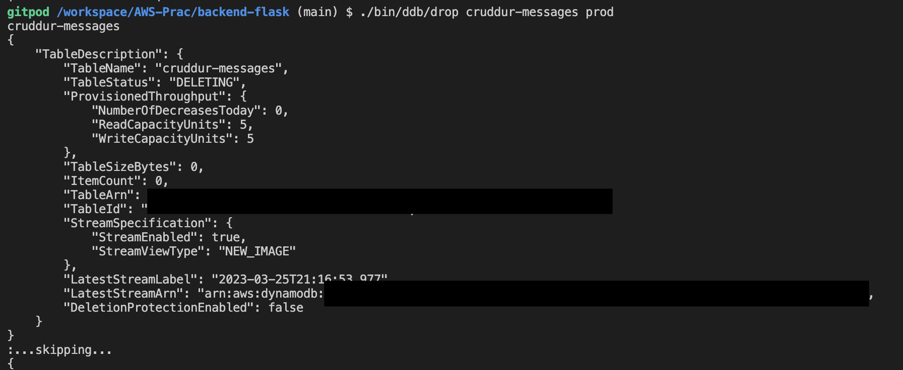

# Week 5 — DynamoDB and Serverless Caching

## Implement DynamoDB Scripts

First, add boto3 to the backend-flask/requirements.txt file
```sh
boto3
```
> boto3 is AWS SDK for python
> Run pip install -r requirements.txt to install the library

Now, we are going to cread a DynamoDB local before creating one in AWS

Make sure to have the following in Docker-compose.yml
```yml
dynamodb-local:
    # https://stackoverflow.com/questions/67533058/persist-local-dynamodb-data-in-volumes-lack-permission-unable-to-open-databa
    # We needed to add user:root to get this working.
    user: root
    command: "-jar DynamoDBLocal.jar -sharedDb -dbPath ./data"
    image: "amazon/dynamodb-local:latest"
    container_name: dynamodb-local
    ports:
      - "8000:8000"
    volumes:
      - "./docker/dynamodb:/home/dynamodblocal/data"
    working_dir: /home/dynamodblocal
```

Create a new folder called 'ddb' under /backend-flask/bin
Create 'schema-load' file under /backend-flask/bin/ddb
```sh
#! /usr/bin/env python3

import boto3
import sys

attrs = {
    'endpoint_url': 'http://localhost:8000'
}
if len(sys.argv) == 2:
    if "prod" in sys.argv[1]:
        attrs = {}

ddb = boto3.client('dynamodb', **attrs)
table_name = 'cruddur-messages'

response = ddb.create_table(
    TableName = table_name,
    AttributeDefinitions=[
        {
            'AttributeName': 'message_group_uuid',
            'AttributeType': 'S'
        },
        {
            'AttributeName': 'pk',
            'AttributeType': 'S'
        },
        {
            'AttributeName': 'sk',
            'AttributeType': 'S'
        },
    ],
    KeySchema=[
        {
            'AttributeName': 'pk',
            'KeyType': 'HASH'
        },
        {
            'AttributeName': 'sk',
            'KeyType': 'RANGE'
        },
    ],
    GlobalSecondaryIndexes=[{
        'IndexName':'message-group-sk-index',
        'KeySchema':[{
        'AttributeName': 'message_group_uuid',
        'KeyType': 'HASH'
        },{
        'AttributeName': 'sk',
        'KeyType': 'RANGE'
        }],
        'Projection': {
        'ProjectionType': 'ALL'
        },
        'ProvisionedThroughput': {
        'ReadCapacityUnits': 5,
        'WriteCapacityUnits': 5
        },
    }],
    BillingMode='PROVISIONED',
    ProvisionedThroughput={
        'ReadCapacityUnits': 5,
        'WriteCapacityUnits': 5
    }
)

print(response)
```

Create 'list-tables' file under /backend-flask/bin/ddb
```sh
#! /usr/bin/bash
set -e # stop if it fails at any point

if [ "$1" = "prod" ]; then
    ENDPOINT_URL=""
else
    ENDPOINT_URL="--endpoint-url=http://localhost:8000"
fi

aws dynamodb list-tables $ENDPOINT_URL \
--query TableNames \
--output table
```

Create 'drop' file under /backend-flask/bin/ddb
```sh
#! /usr/bin/bash
set -e # stop if it fails at any point

#./bin/ddb/drop cruddur-messages prod

if [ -z "$1" ]; then
    echo "No TABLE_NAME argument supplied eg) ./bin/ddb/drop cruddur-messages prod"
    exit 1
fi
TABLE_NAME=$1

if [ "$2" = "prod" ]; then
    ENDPOINT_URL=""
else
    ENDPOINT_URL="--endpoint-url=http://localhost:8000"
fi

echo "$TABLE_NAME"

aws dynamodb delete-table $ENDPOINT_URL \
--table-name $TABLE_NAME
```

Create 'seed' file under /backend-flask/bin/ddb
```sh
#! /usr/bin/env python3

import boto3
import sys
from datetime import datetime, timedelta, timezone
import uuid
import os

current_path = os.path.dirname(os.path.abspath(__file__))
parent_path = os.path.abspath(os.path.join(current_path, '..', '..'))
sys.path.append(parent_path)
from lib.db import db

attrs = {
  'endpoint_url': 'http://localhost:8000'
}
# unset endpoint url for use with production database
if len(sys.argv) == 2:
  if "prod" in sys.argv[1]:
    attrs = {}
ddb = boto3.client('dynamodb',**attrs)

def get_user_uuids():
  sql = """
    SELECT 
      users.uuid,
      users.display_name,
      users.handle
    FROM users
    WHERE
      users.handle IN(
        %(my_handle)s,
        %(other_handle)s
        )
  """
  users = db.query_array_json(sql,{
    'my_handle':  'Sunyoung',
    'other_handle': 'Scarlett'
  })
  my_user    = next((item for item in users if item["handle"] == 'Sunyoung'), None)
  other_user = next((item for item in users if item["handle"] == 'Scarlett'), None)
  results = {
    'my_user': my_user,
    'other_user': other_user
  }
  print('get_user_uuids')
  print(results)
  return results


def create_message(client,message_group_uuid, created_at, message, my_user_uuid, my_user_display_name, my_user_handle):
    print("")

message_group_uuid = "5ae290ed-55d1-47a0-bc6d-fe2bc2700399" #str(uuid.uuid4())
users = get_user_uuids()
now = datetime.now(timezone.utc).astimezone()

def create_message_group(client,message_group_uuid, my_user_uuid, last_message_at=None, message=None, other_user_uuid=None, other_user_display_name=None, other_user_handle=None):
  table_name = 'cruddur-messages'
  record = {
    'pk':   {'S': f"GRP#{my_user_uuid}"},
    'sk':   {'S': last_message_at},
    'message_group_uuid': {'S': message_group_uuid},
    'message':  {'S': message},
    'user_uuid': {'S': other_user_uuid},
    'user_display_name': {'S': other_user_display_name},
    'user_handle': {'S': other_user_handle}
  }

  response = client.put_item(
    TableName=table_name,
    Item=record
  )
  print(response)

def create_message(client,message_group_uuid, created_at, message, my_user_uuid, my_user_display_name, my_user_handle):
  table_name = 'cruddur-messages'
  record = {
    'pk':   {'S': f"MSG#{message_group_uuid}"},
    'sk':   {'S': created_at },
    'message_uuid': { 'S': str(uuid.uuid4()) },
    'message': {'S': message},
    'user_uuid': {'S': my_user_uuid},
    'user_display_name': {'S': my_user_display_name},
    'user_handle': {'S': my_user_handle}
  }
  # insert the record into the table
  response = client.put_item(
    TableName=table_name,
    Item=record
  )
  # print the response
  print(response)


create_message_group(
  client=ddb,
  message_group_uuid=message_group_uuid,
  my_user_uuid=users['my_user']['uuid'],
  other_user_uuid=users['other_user']['uuid'],
  other_user_handle=users['other_user']['handle'],
  other_user_display_name=users['other_user']['display_name'],
  last_message_at=now.isoformat(),
  message="this is a filler message"
)

create_message_group(
  client=ddb,
  message_group_uuid=message_group_uuid,
  my_user_uuid=users['other_user']['uuid'],
  other_user_uuid=users['my_user']['uuid'],
  other_user_handle=users['my_user']['handle'],
  other_user_display_name=users['my_user']['display_name'],
  last_message_at=now.isoformat(),
  message="this is a filler message"
)

conversation = """
Person 1: Hello!
Person 2: Hi!
Person 1: Hello?
Person 2: Hi?
"""

lines = conversation.lstrip('\n').rstrip('\n').split('\n')
print("=============================")
print(lines)

for i in range(len(lines)):
  if lines[i].startswith('Person 1: '):
    key = 'my_user'
    message = lines[i].replace('Person 1: ', '')
  elif lines[i].startswith('Person 2: '):
    key = 'other_user'
    message = lines[i].replace('Person 2: ', '')
  else:
    print(lines[i])
    raise 'invalid line'

  created_at = (now + timedelta(minutes=i)).isoformat()
  create_message(
    client=ddb,
    message_group_uuid= message_group_uuid,
    created_at=created_at,
    message=message,
    my_user_uuid=users[key]['uuid'],
    my_user_display_name=users[key]['display_name'],
    my_user_handle=users[key]['handle']
  )
```

Create 'scan' file under /backend-flask/bin/ddb
```sh
#!/usr/bin/env python3

import boto3

attrs = {
  'endpoint_url': 'http://localhost:8000'
}
ddb = boto3.resource('dynamodb',**attrs)
table_name = 'cruddur-messages'

table = ddb.Table(table_name)
response = table.scan()
items = response['Items']
for item in items:
    print(item)
```

Create a new folder called 'patterns' under /backend-flask/bin/ddb
Create 'get-conversation' file under /backend-flask/bin/ddb/patterns
```sh
#!/usr/bin/env python3

import boto3
import sys
import json
import datetime

attrs = {
  'endpoint_url': 'http://localhost:8000'
}

if len(sys.argv) == 2:
  if "prod" in sys.argv[1]:
    attrs = {}

dynamodb = boto3.client('dynamodb',**attrs)
table_name = 'cruddur-messages'

message_group_uuid = "5ae290ed-55d1-47a0-bc6d-fe2bc2700399"
current_year = str(datetime.now().year)
# define the query parameters
query_params = {
  'TableName': table_name,
  'ReturnConsumedCapacity': 'TOTAL',
  'KeyConditionExpression': 'pk = :pk AND begins_with(sk,:year)',
#   'KeyConditionExpression': 'pk = :pk AND sk BETWEEN :start_date AND :end_date',
  'ScanIndexForward': False,
  'Limit': 20,
  'ExpressionAttributeValues': {
     ':year': {'S': current_year },
    # ":start_date": { "S": "2023-03-01T00:00:00.000000+00:00" },
    # ":end_date": { "S": "2023-03-19T23:59:59.999999+00:00" },
    ':pk': {'S': f"MSG#{message_group_uuid}"}
  }
}

# query the table
response = dynamodb.query(**query_params)

# print the items returned by the query
print(json.dumps(response, sort_keys=True, indent=2))

# print the consumed capacity
print(json.dumps(response['ConsumedCapacity'], sort_keys=True, indent=2))

items = response['Items']
items.reverse()


for item in items:
  sender_handle = item['user_handle']['S']
  message       = item['message']['S']
  timestamp     = item['sk']['S']
  dt_object = datetime.datetime.strptime(timestamp, '%Y-%m-%dT%H:%M:%S.%f%z')
  formatted_datetime = dt_object.strftime('%Y-%m-%d %I:%M %p')
  print(f'{sender_handle: <16}{formatted_datetime: <22}{message[:40]}...')
```

Create 'list-conversations' file under /backend-flask/bin/ddb/patterns
```sh
#!/usr/bin/env python3

import boto3
import sys
import json
import os
import datetime

current_path = os.path.dirname(os.path.abspath(__file__))
parent_path = os.path.abspath(os.path.join(current_path, '..', '..', '..'))
sys.path.append(parent_path)
from lib.db import db

attrs = {
  'endpoint_url': 'http://localhost:8000'
}

if len(sys.argv) == 2:
  if "prod" in sys.argv[1]:
    attrs = {}

dynamodb = boto3.client('dynamodb',**attrs)
table_name = 'cruddur-messages'

def get_my_user_uuid():
  sql = """
    SELECT 
      users.uuid
    FROM users
    WHERE
      users.handle =%(handle)s
  """
  uuid = db.query_value(sql,{
    'handle':  'andrewbrown'
  })
  return uuid

my_user_uuid = get_my_user_uuid()
print(f"my-uuid: {my_user_uuid}")

current_year = str(datetime.now().year)
# define the query parameters
query_params = {
  'TableName': table_name,
      'KeyConditionExpression': 'pk = :pk AND begins_with(sk,:year)',
  'ScanIndexForward': False,
  'ExpressionAttributeValues': {
    ':year': {'S': current_year },
    ':pk': {'S': f"GRP#{my_user_uuid}"}
  },
  'ReturnConsumedCapacity': 'TOTAL'
}

# query the table
response = dynamodb.query(**query_params)

# print the items returned by the query
print(json.dumps(response, sort_keys=True, indent=2))
```

We added one more paramater in print_sql function in db.py file
```py
def print_sql(self,title,sql,params={}):
```
> Make sure to match the parameters where this function is called

## Result from implementing DynamoDB Scripts
Make sure to do 'chmod u+x ./bin/ddb/filename' before running the scripts





> Make sure to run ./bin/db/setup before inserting seed data so that we can have the table 'users'
> Also, make sure to match the names in the table 'users' and 


> Reference: https://boto3.amazonaws.com/v1/documentation/api/latest/guide/dynamodb.html


## Implement Update Cognito ID Script for Postgres Database

